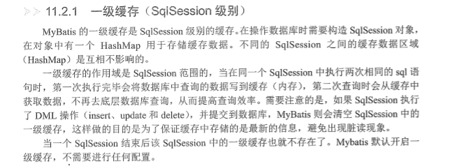
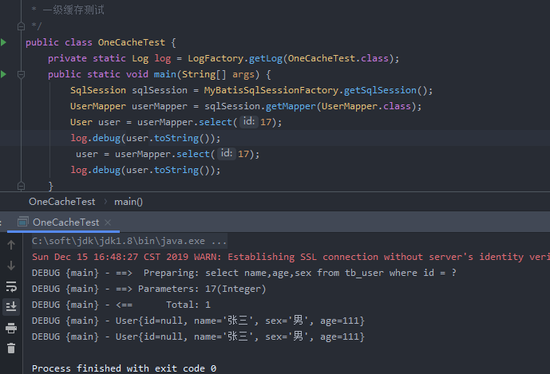
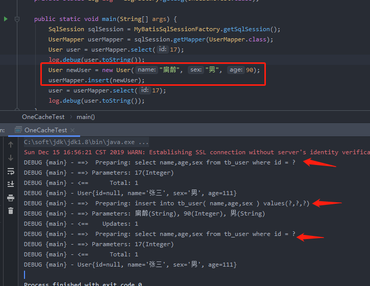
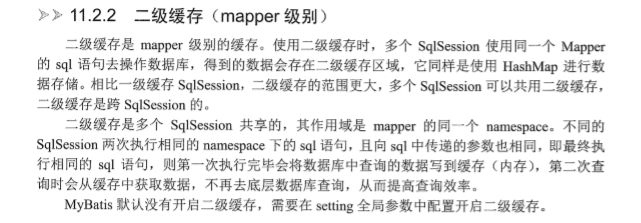
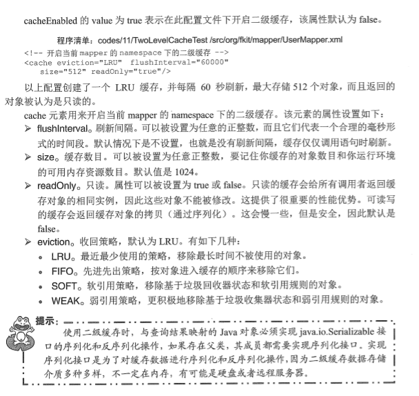

# MyBatis的事务和缓存

## 1. MyBatis的事务

JdbcTransaction： 使用数据库连接 Connection 的commit、rollback来实现事务

ManagedTransaction： 让容器来管理事务，ManagedTransaction的commit和rollback不会做任何操作。

## 2. MyBatis的缓存

### 2.1 一级缓存

 一级缓存： SQLSession级别的缓存。




 同一个查询执行了2次，但是只有一次数据库访问:



第一次查询后，执行了insert、delete、update之后(无论是不是这个表的)，将会清空一级缓存:




#### 2.1.1 清除一级缓存

`sqlSession.clearCache();`

### 2.2 二级缓存

二级缓存是 mapper级别的缓存。



```xml
<setting name="cacheEnabled" value="true"/>  <!-- 加载config.xml里面 -->
<cache eviction="LRU" flushInterval="6000" size="512" readOnly="true"/> <!-- mapper.xml里面 --> 
```



