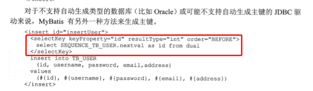

## 获取主键

### 数据库支持自增时

当 POJO的主键自增时，获取这个值:

```xml
  <insert  useGeneratedKeys="true" keyProperty="id">  <!-- 加上这2个属性即可  -->
```

### 数据库不支持自增时

使用selectKey标签



## resultMap 使用

当返回的结果的字段和POJO的属性对不上时，可以使用resultMap:

```xml
<resultMap id="user2Map" type="domain.User">
	<id property="id" column="user_id"/>  <!--这里使用result好像也正常 -->
    <result property="name" column="user_name" />
    <result property="age" column="user_age"/>
	<result property="sex" column="user_sex"/>
</resultMap>
<select id="select2" resultMap="user2Map" parameterType="int">
	select * from tb_user_2
</select>
```

关联映射：

```java
//班级类
public class Clazz {
    private Integer id;
    private String code;
}
//学生类
public class Student {
    private Integer id;
    private String name;
    private String sex;
    private Integer age;
    private Clazz clazz;
}
```

查询 Student 时，讲 Clazz 也 自动查出来 :

```xml
  <resultMap id="studenMap" type="domain.Student">
        <id property="id" column="id"/>
        <result property="name" column="name"/>
        <result property="sex" column="sex"/>
        <result property="age" column="age"/>
        <association property="clazz"  column="clazz_id" javaType="domain.Clazz" select="selectClazzById"/>
    </resultMap>

    <select id="selectClazzById" resultType="domain.Clazz">
        select * from tb_clazz where id =#{id}
    </select>

    <select id="selectAll"  resultMap="studenMap">
        select * from tb_student
    </select>
```

## 立刻加载和lazy加载

一般1对多的情况下， 应该设置成 lazy加载,在访问这个属性的时候，才会去查询。

要使 lazy加载生效:

```xml
<setting name="lazyLoadingEnabled" value="true"/>
<setting name="aggressiveLazyLoading" value="false"/>

<association fetchType="lazy" />
```


## 动态SQL

- if
- choose (when  othewise)
- where
- set
- foreach
- bind

### if

```xml
 <select id="selectByName" resultType="domain.Clazz">
        select * from tb_user where 1=1
        <if test="name !=null">
            and name = #{name}
        </if>
    </select>
```

### choose 

```xml
<!-- 相当于 switch -->  
<select id="selectByChoose" resultType="user">
        select * from tb_user where 1=1
        <choose>
            <when test="name !=null">
                and name = #{name}
            </when>
            <when test="sex!=null">
                and sex = #{sex}
            </when>
            <otherwise>
                and 1 =2
            </otherwise>
        </choose>
    </select>

```

### where

where 标签可以自动加上或者去掉where ，也可以处理好多余的 and 、or 


### set


### foreach

in 列表


注意，这里使用的时候要传入一个map。直接传进去是不行的。


## 模糊查询

写法1：`like '%${name}%'`  可能导致SQL注入

写法2： `name like "%"#{name}"%"`

写法3： concat('%',#{name},'%')

写法4： 使用bind标签


## 杂项

配置sql时，可以不指定参数类型，mybatis一般情况可以自动推断（不清楚什么时候不能推断），而且不指定类型时，可以在接口里面定义重载的方法。

