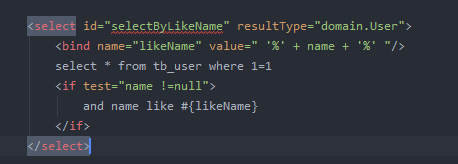
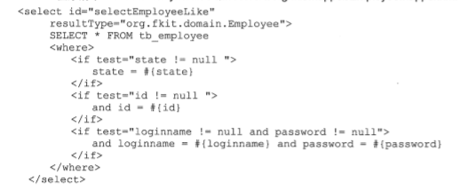
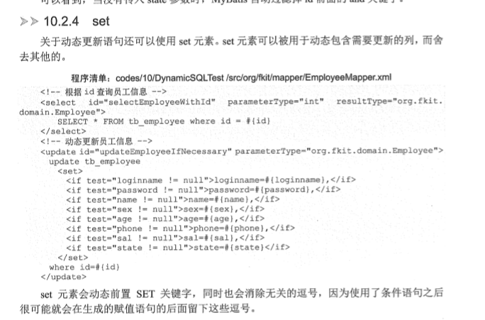
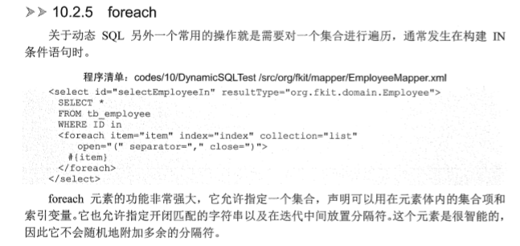
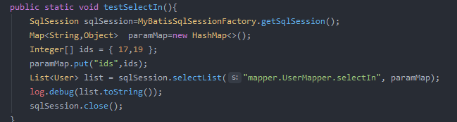
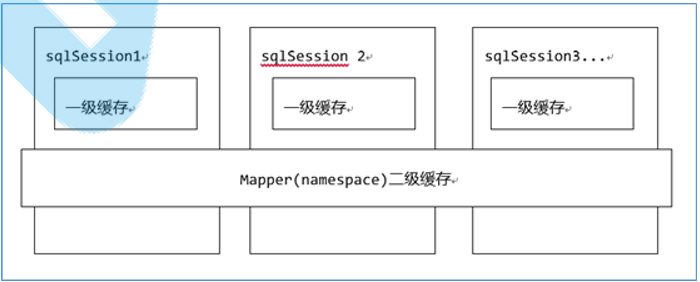
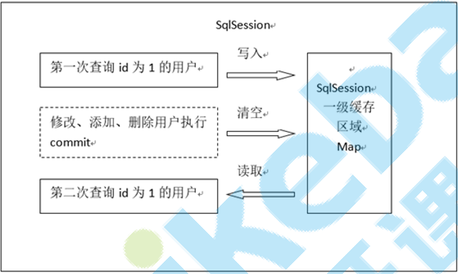
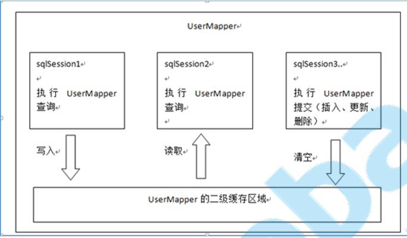

# Mybatis 使用

Mybatis的中文官网挺详细的: https://mybatis.org/mybatis-3/zh

[toc]

## Mybatis和Hibernate 的区别

| 对比项       | Mybatis                | Hibernate              |
| ------------ | ---------------------- | ---------------------- |
| 市场占有率   | 高                     | 高                     |
| 适合的行业   | 互联网、电商项目       | 传统的(ERP、CRM、OA)   |
| 性能         | 高                     | 低                     |
| SQL灵活性    | 高                     | 低                     |
| 学习门槛     | 低                     | 高                     |
| Sql配置文件  | 全局配置文件、映射文件 | 全局配置文件、映射文件 |
| ORM          | 半自动化               | 完全的全自动化         |
| 数据库无关性 | 低                     | 高                     |

# 1. 入门篇

## 1.1 简单使用

### 1.1.1  编码流程 

1. 编写全局配置文件：SqlMapConfig.xml
2.  映射文件：xxxMapper.xml 
3. 编写dao代码：xxxDao接口、xxxDaoImpl实现类 
4.  POJO类 
5. 单元测试类

### 1.1.2  具体代码

#### 1.1.2.1  SqlMapConfig.xml

```xml
<?xml version="1.0" encoding="UTF-8"?>
<!DOCTYPE configuration PUBLIC "-//mybatis.org//DTO Config 3.0//EN" "http://mybatis.org/dtd/mybatis-3-config.dtd">
<!-- XML配置文件包含对 Mybatis 系统的核心设置 -->
<configuration>
    <properties resource="db.properties"/>
    <!-- 指定 Mybatis 所用日志的具体实现 -->
    <settings>
        <setting name="logImpl" value="LOG4j2" />
    </settings>
    <!-- 环境配置，即连接的数据库 -->
    <environments default="mysql">
        <environment id="mysql">
            <!-- 指定事务管理类型 -->
            <!-- 这里简单的使用JDBC的提交和回滚 -->
            <transactionManager type="JDBC" />
            <!-- POOLED 是 JDBC 的数据源连接池的实现 -->
            <dataSource type="POOLED">
                <property name="driver" value="${jdbc.driver}" />
                <property name="url" value="${jdbc.url}" />
                <property name="username" value="${jdbc.username}" />
                <property name="password" value="${jdbc.password}" />
            </dataSource>
        </environment>
    </environments>
    <!-- mappers 告诉Mybatis 去哪里 找持久化类的映射文件 -->
    <mappers>
        <mapper resource="mapper/UserMapper.xml" />
    </mappers>
</configuration>
```

#### 1.1.2.2  mapper/ClazzMapper.xml

```xml
<?xml version="1.0" encoding="UTF-8"?>
<!DOCTYPE mapper PUBLIC "-//mybatis.org//DTO Mapper 3.0//EN" "http://mybatis.org/dtd/mybatis-3-mapper.dtd">

<mapper namespace="mapper.ClazzMapper">
    <select id="selectById" resultType="domain.Clazz">
        select * from tb_class where id = #{id}
    </select>
</mapper>
```

#### 1.1.2.3 dao.ClazzDao 

```java
package dao;

import domain.Clazz;

public interface ClazzDao {
    Clazz selectById(Integer id);
}
```

#### 1.1.2.4  dao.impl.ClazzDaoImpl

```java
package dao.impl;

import dao.ClazzDao;
import domain.Clazz;
import org.apache.ibatis.session.SqlSession;
import org.apache.ibatis.session.SqlSessionFactory;

public class ClazzDaoImpl implements ClazzDao {
    SqlSessionFactory factory;

    public ClazzDaoImpl(SqlSessionFactory factory) {
        this.factory = factory;
    }

    public Clazz selectById(Integer id) {
        Clazz clazz =null;
        try(SqlSession sqlSession = factory.openSession()) {
             clazz = sqlSession.selectOne("mapper.ClazzMapper.selectById", id);
        }
        return clazz;
    }
}
```

#### 1.1.2.5 测试代码

```java
import dao.ClazzDao;
import dao.impl.ClazzDaoImpl;
import domain.Clazz;
import lombok.extern.slf4j.Slf4j;
import org.apache.ibatis.io.Resources;
import org.apache.ibatis.session.SqlSessionFactory;
import org.apache.ibatis.session.SqlSessionFactoryBuilder;
import org.junit.Before;
import org.junit.Test;

import java.io.IOException;
import java.io.InputStream;

@Slf4j
public class ClazzDaoTest {
    SqlSessionFactory factory;
    @Before
    public void init() {
        try {
            InputStream stream = Resources.getResourceAsStream("SqlMapConfig.xml");
            factory = new SqlSessionFactoryBuilder().build(stream);
        } catch (IOException e) {
            log.error("初始化SQLSessionFactory出错", e);
        }
    }
    @Test
    public void testClazz(){
        ClazzDao clazzDao =new ClazzDaoImpl(factory);
        Clazz clazz = clazzDao.selectById(1);
        log.info("查询结果:{}",clazz);
    }
}
```

## 1.2 使用mapper接口

使用mapper接口时，mapper接口的package 需要与 mapper.xml的 namespace 一致，同时不需要手写实现类。示例如下:

### 1.2.1  mapper/UserMapper.xml

```xml
<?xml version="1.0" encoding="UTF-8"?>
<!DOCTYPE mapper PUBLIC "-//mybatis.org//DTO Mapper 3.0//EN" "http://mybatis.org/dtd/mybatis-3-mapper.dtd">

<mapper namespace="mapper.UserMapper">

    <select id="selectAll" resultType="domain.User">
        select * from tb_user
    </select>

    <select id="selectById" resultType="domain.User">
        select * from tb_user where id = #{id}
    </select>

</mapper>

```

### 1.2.2  mapper/UserMapper.java

```java
package mapper;

import domain.User;

import java.util.List;

public interface UserMapper {
    List<User> selectAll();

    User selectById(Integer id);
}
```

### 1.2.3 测试代码

```java
import domain.User;
import lombok.extern.slf4j.Slf4j;
import mapper.UserMapper;
import org.apache.ibatis.io.Resources;
import org.apache.ibatis.session.SqlSession;
import org.apache.ibatis.session.SqlSessionFactory;
import org.apache.ibatis.session.SqlSessionFactoryBuilder;
import org.junit.Before;
import org.junit.Test;

import java.io.IOException;
import java.io.InputStream;

@Slf4j
public class UserMapperTest {

    SqlSessionFactory factory;
    
    @Before
    public void init() {
        try {
            InputStream stream = Resources.getResourceAsStream("SqlMapConfig.xml");
            factory = new SqlSessionFactoryBuilder().build(stream);
        } catch (IOException e) {
            log.error("初始化SQLSessionFactory出错", e);
        }
    }
    @Test
    public void test(){
        try (SqlSession sqlSession = factory.openSession()) {
            UserMapper mapper = sqlSession.getMapper(UserMapper.class);
            User user = mapper.selectById(1);
            // sqlSession.commit();  注意，默认情况下，需要手动commit
            log.info("查询结果:{}",user);
        }
    }
}
```

## 1.3 获取主键

### 1.3.1 使用数据库主键自增时 （MYSQL 写法1 ）

#### 1.3.1.1   mapper/UserMapper.xml

```xml
<insert id="insert" useGeneratedKeys="true" keyProperty="id" >
    INSERT INTO tb_user(name,sex, age)
    VALUES (#{name},#{sex},#{age});
</insert>
```

#### 1.3.1.2  测试代码

```java
@Test
public  void testInsert(){
    try (SqlSession sqlSession = factory.openSession()) {
        UserMapper mapper = sqlSession.getMapper(UserMapper.class);
        User user = new User();
        user.setName("王五");
        user.setAge(120);
        user.setSex("男");
        mapper.insert(user);
        sqlSession.commit();
        log.info("结果:{}",user);
    }
}
```

### 1.3.2  使用数据库主键自增时（MYSQL 写法2 ）

#### 1.3.2.1   mapper/UserMapper.xml

```xml
<insert id="insert2">
    <selectKey keyProperty="id" order="AFTER" resultType="int">
        select LAST_INSERT_ID()
    </selectKey>
    INSERT INTO tb_user(name,sex, age)
    VALUES (#{name},#{sex},#{age});
</insert>
```

order：selectKey标签中的sql的执行顺序，是相对与insert语句来说。由于mysql的自增原理，执 行完insert语句之后才将主键生成，所以这里selectKey的执行顺序为after。 

LAST_INSERT_ID():是mysql的函数，返回auto_increment自增列新记录id值。 

这里不是很理解为什么要用这个，我觉得写法1 更好一些

### 1.3.3  不使用数据库主键自增时

也是使用selectKey标签,参考  1.3.2

#### 1.3.3.1  mapper/TeacherMapper.xml

```xml
<?xml version="1.0" encoding="UTF-8"?>
<!DOCTYPE mapper PUBLIC "-//mybatis.org//DTO Mapper 3.0//EN" "http://mybatis.org/dtd/mybatis-3-mapper.dtd">

<mapper namespace="mapper.TeacherMapper">
    <insert id="insert">
        <selectKey keyProperty="id" order="BEFORE" resultType="string">
            select  UUID()
        </selectKey>
        INSERT INTO tb_teacher(id, name)
        VALUES (#{id}, #{name});
    </insert>
</mapper>
```

其它代码和上述一样就可以了。

### 1.3.4 注解方式 开发时，返回主键

#### 1.3.4.1 不使用主键自增时

```java
@Insert("INSERT INTO tb_teacher(id, name) VALUES (#{id}, #{name})")
@SelectKey(statement = "select  UUID()",keyProperty = "id",before = true,resultType = String.class)
void insert(Teacher  teacher);
```

#### 1.3.4.2 使用主键自增时

```java
@Insert({" INSERT INTO tb_user(name,sex, age)  VALUES (#{name},#{sex},#{age}) "})
@Options(useGeneratedKeys = true,keyProperty ="id") // 这里默认为 id字段，可以不写
void insert3(User user);
```

## 1.4  注解方式开发

### 1.4.1  简单使用

#### 1.4.1.1  mapper/TeacherMapper.xml

即使不在mapper.xml 里面编写SQL，mapper.xml还是要存在的。

```xml
<?xml version="1.0" encoding="UTF-8"?>
<!DOCTYPE mapper PUBLIC "-//mybatis.org//DTO Mapper 3.0//EN" "http://mybatis.org/dtd/mybatis-3-mapper.dtd">

<mapper namespace="mapper.TeacherMapper">

</mapper>
```

#### 1.4.1.2  mapper.TeacherMapper.java

```java
package mapper;

import domain.Teacher;
import org.apache.ibatis.annotations.Param;
import org.apache.ibatis.annotations.Select;

import java.util.List;

public interface TeacherMapper {

     @Select("select * from tb_teacher where name = #{name}")
     List<Teacher>  selectAll(@Param("name") String name);
}
```

#### 1.4.1.3 测试代码

```java
@Test
public void testSelectAll(){
    String name="七七";
    TeacherMapper mapper = sqlSession.getMapper(TeacherMapper.class);
    List<Teacher> teacherList = mapper.selectAll(name);
    log.info("{}",teacherList);
}
```


##  1.5  输入映射和输出映射

### 1.5.1 输入映射 (parameterType)

#### 1.5.1.1  传递POJO对象

普通的POJO对象，当成Map 一样，直接使用 #{} 或者 ${} 引用即可。 可以不指定POJO类型，mybatis一般情况可以自动推断（不清楚什么时候不能推断），而且不指定类型时，可以在接口里面定义重载的方法。

#### 1.5.1.2 传递嵌套POJO对象

嵌套POJO实际上是使用OGNL 从对象中取值

```java
//UserVo.java
@Data
public class UserVo {
    private User user;
}

//UserMapper.java
public interface UserMapper {
    @Select("select * from tb_user where id =#{user.id} ")
    User selectById2(UserVo vo);
}
//UserMapperTest.java
@Test
public void testSelectById2(){
    try (SqlSession sqlSession = factory.openSession()) {
        UserMapper mapper = sqlSession.getMapper(UserMapper.class);
        UserVo vo =new UserVo();
        User user =new User();
        user.setId(1);
        vo.setUser(user);
        user = mapper.selectById2(vo);
        log.info("查询结果:{}",user);
    }
}
```

#### 1..5.1.3 #{} 和 ${} 的区别

**#{}**

​	当参数类型是基本类型和String的时候，#{}  可以任意，比如说 #{id}

​	相当于  占位符 ? 

**${}**

​	当参数类型是基本类型和String的时候，${} 只能是${value}

​	拼接字符串的时候相当于 + 号

​	有SQL注入的风险。 

​	在 #{} 之前解析。

**共同点** 

​	参数类型是POJO的时候，#{} 和 ${} 一样

### 1.5.2 输出映射 (resultType)

#### 1.5.2.1 驼峰规则输出映射

全局配置文件的 **settings**  加入下列配置 可以开启 驼峰规则输出映射:

```xml
<setting name="mapUnderscoreToCamelCase" value="true"/>
```


#### 1.5.2.2  输出映射 (简单类型)

输出结果映射为简单类型时，必须保证结果只有一列

#### 1.5.2.3 输出映射 (POJO-resultType )

使用 resultType 作为输出映射时，需要保持结果的字段名和POJO的列名 一致。貌似resultType底层也是resultMap。

#### 1.5.2.4 输出映射 (POJO-resultMap，一对一、一对多)

当返回的结果的字段和POJO的属性对不上时，可以使用resultMap。

**简单映射：**

注意简单映射时，即使设置了驼峰规则映射， 列名 column 字段还是要使用 数据库原来的字段名。

如果使用默认的映射，可以不使用result 标签列出来，例如，下面 term  字段就可以省略。MyBatis的文档里面建议制定 id 字段，说不指定会有性能问题

```xml
<resultMap id="repayPlanMap" type="domain.RepayPlan">
    <id column="loan_no" property="loanNo" />
    <id column="term" property="term"/>
    <result column="amt" property="amt" />
</resultMap>

<select id="selectById" resultMap="repayPlanMap">
    select loan_no,term,amt from repay_plan where loan_no = #{loanNo} and term = #{term}
</select>
```

**关联映射：**

```java
//班级类
public class Clazz {
    private Integer id;
    private String code;
}
//学生类
public class Student {
    private Integer id;
    private String name;
    private String sex;
    private Integer age;
    private Clazz clazz;
}
```

查询 Student 时，把 Clazz 也 自动查出来 :

要注意的事， association 标签的 select 属性的值是当前文件的其它select 语句的id，个人觉得应该可以引用其它文件的才对，但是使用 namespace+id 的时候失败了。

```xml
  <resultMap id="studenMap" type="domain.Student">
        <id property="id" column="id"/>
        <result property="name" column="name"/>
        <result property="sex" column="sex"/>
        <result property="age" column="age"/>
        <association property="clazz"  column="clazz_id" javaType="domain.Clazz" select="selectClazzById"/>
    </resultMap>

    <select id="selectClazzById" resultType="domain.Clazz">
        select * from tb_clazz where id =#{id}
    </select>

    <select id="selectAll"  resultMap="studenMap">
        select * from tb_student
    </select>
```

**association和collection的区别**

association 主要是一对一的时候使用， 例如前面查询 Student 之后，如果访问 Clazz ，则会在查询一次，把clazz也查出来。也可以用在一对多的情况下。但是collection 更适合一对多一些。如下图：

```xml
  <resultMap id="clazzMap" type="clazz">
        <id column="c_id" property="id"/>
        <result property="code" column="code"/>
        <collection property="studentList" ofType="student">
            <id column="id" property="id"/>
            <result property="name" column="name"/>
            <result property="sex" column="sex"/>
            <result property="age" column="age"/>
            <result property="clazz_id" column="c_id"/>
        </collection>

    </resultMap>

    <select id="selectById2" resultMap="clazzMap">
        select s.*,c.id c_id,c.code from tb_clazz c LEFT JOIN tb_student s on c.id=s.clazz_id where c.id=#{id}
    </select>
```

这是一个左连接，查询clazz的时候把clazz关联的student也查出来了。就算记录比较多，也是查询一次，如果换成association，每一条记录都可能导致再查一次。

#### 1.5.2.5 输出映射（注解方式，一对一、一对多）

```java
/**
     * 通过id查询的另一种写法
     */
@Select("select * from tb_user where id=#{id}")
@Results({
    @Result(id = true,column = "id",property = "id"),
    @Result(property = "name",column = "name"),
    @Result(property = "age",column = "age")
})
User selectById2(Integer id);
```

**一对一**

```java
//clazzMapper

@Select("select * from tb_clazz where id = #{id}")
Clazz selectById(Integer id);

//StudentMapper
@Select("select * from tb_student where id = #{id}")
@Results({
	@Result(id = true,property = "id",column = "id"),
    @Result(property = "name",column = "name"),
    @Result(property = "sex",column = "sex"),
    @Result(property = "age",column = "age"),
    @Result(property = "clazz_id",column = "clazz_id"),
    @Result(property = "clazz",column = "clazz_id",one = @One(
    		select = "mapper.ClazzMapper.selectById",
            fetchType = FetchType.EAGER
		))
    })
    Student selectById(Integer id);
}
```

**一对多**

```java
//StudentMapper  
@Select("select * from tb_student where clazz_id=#{clazzId}")
List<Student> selectByClazzId(Integer clazzId);

//ClazzMapper
@Select("select * from tb_clazz where id = #{id}")
@Results({
	@Result(id = true, property = "id", column = "id"),
    @Result(property = "code", column = "code"),
    @Result(property = "studentList", column = "id",
    		many = @Many(select = "mapper.StudentMapper.selectByClazzId",fetchType = FetchType.LAZY)
		)
})
Clazz selectById(Integer id);
```

## 1.6 全局配置文件

### 1.6.1 全局配置顺序

全局配置有顺序要求，如果顺序不对，则会报错:

```
properties（属性）
settings（全局配置参数）
typeAliases（类型别名）
typeHandlers（类型处理器）--Java类型--JDBC类型--->数据库类型转换
objectFactory（对象工厂）
plugins（插件）--可以在Mybatis执行SQL语句的流程中，横叉一脚去实现一些功能增强，比如 PageHelper分页插件，就是第三方实现的一个插件
environments（环境集合属性对象）
environment（环境子属性对象）       
	transactionManager（事务管理）       
	dataSource（数据源） 
mappers（映射器）
```

### 1.6.2  properties

#### 1.6.2.1 引用配置文件

properties 标签可以引用配置文件中的配置信息

```xml
<properties resource="db.properties"/>
```

然后在要使用的地方 使用 ${} 引用配置。

#### 1.6.2.2 定义属性和值

```xml
<properties>
    <property name="" value=""/>
</properties>
```

#### 1.6.2.3 属性加载顺序

读取properties 元素体内定义的属性。 

读取properties 元素中resource或 url 加载的属性，它会覆盖已读取的同名属性。 

注意**只能有一个properties 标签**，所以如果要同时引用配置文件和自定义属性时，要写在一个properties标签里面

### 1.6.3 typeAlias

别名，简化映射文件中parameterType和ResultType中的POJO类型名称编写。 

用别名就不用写完整路径了。比如  domain.User   ，可以写成别名  user 

#### 1.6.3.1 默认别名

| 别名       | 映射的类型 |
| ---------- | ---------- |
| _byte      | byte       |
| _long      | long       |
| _short     | short      |
| \_int      | int        |
| \_integer  | int        |
| \_double   | double     |
| \_float     | float       |
| \_boolean  | boolean    |
| string     | String     |
| byte       | Byte       |
| long       | Long       |
| short      | Short      |
| int        | Integer    |
| integer    | Integer    |
| double     | Double     |
| float       | Float      |
| boolean    | Boolean    |
| date       | Date       |
| decimal    | BigDecimal |
| bigdecimal | BigDecimal |
| map        | Map        |

大致规律: 原始型 前面都加上了 _  ,包装类都 简化成了原始型。

#### 1.6.3.2 自定义别名

```xml
<typeAliases>
    <typeAlias type="domain.User" alias="user" />
</typeAliases>
```

#### 1.6.3.3 批量自定义别名

扫描路径下的所有类，都起个别名，默认别名是 类名称的首字母小写，例如User 为 user

```xml
<typeAliases>
    <package name="domain"/>
</typeAliases>
```

### 1.6.4 mappers 标签

#### 1.6.4.1 引入指定 mapper.xml 文件

```xml
<mappers>
    <mapper resource="mapper/UserMapper.xml" />
</mappers>
```

#### 1.6.4.2  引入指定文件夹下面的所有mapper.xml 文件

此种方法要求mapper.xml 的namespace 和  mapper接口的package 相同。

```xml
<mappers>
    <package name="mapper"/>
</mappers>
```

## 1.7 模糊查询

写法1：`like '%${name}%'`  可能导致SQL注入

写法2： `name like "%"#{name}"%"`

写法3： concat('%',#{name},'%')

写法4： 使用bind标签



## 1.8 动态SQL

### 1.8.1 注解方式动态SQL

```java
//StudentMapper
@SelectProvider(type = StudentDynaSqlProvider.class,method = "selectWithParam")
List<Student> selectByParam(Map<String,Object> paramMap);

//StudentDynaSqlProvider
/**
 * 动态SQL
 */
public class StudentDynaSqlProvider {

    public String selectWithParam(Map<String, Object> paramMap) {
        //写法1：
        SQL sql = new SQL();
        sql.SELECT("*").FROM("tb_student");
        if (paramMap.containsKey("name")) {
            sql.WHERE("name = #{name}");
        }

        //写法2：
        sql = new SQL() {
            {
                SELECT("*");
                FROM("tb_student");
                if (paramMap.containsKey("name")) {
                    WHERE("name = #{name}");
                }
                if(paramMap.containsKey("age")){
                    WHERE("age=#{age}");
                }
            }
        };
        return sql.toString();
    }
}

```

# 2. 高级应用

## 2.1  关联查询

关联查询有2种，一种是利用 连接查询，一次性将关联表的数据也查询出来，再利用resultMap映射到对应的POJO中。另一种是 先查出一个表的数据，再在resultMap中配置  association (一对一)或者 collection  (一对多) 查询。

## 2.2 延迟加载 

MyBatis中的延迟加载，也称为懒加载，是指在进行关联查询时，按照设置延迟规则推迟对关联对象的select查询。延迟加载可以有效的减少数据库压力。 Mybatis的延迟加载，需要通过resultMap标签中的association和collection子标签才能演示成 功。 Mybatis的延迟加载，也被称为是嵌套查询，对应的还有嵌套结果的概念，可以参考一对多关联的 案例。 注意：MyBatis的延迟加载只是对关联对象的查询有延迟设置，对于主加载对象都是直接执行查询语句的。 

### 2.2.1 侵入式延迟

执行对主加载对象的查询时，不会执行对关联对象的查询。但当要访问主加载对象的 某个属性（该属性不是关联对象的属性）时，就会马上执行关联对象的select查询。

```xml
<settings>  
    <!-- 延迟加载总开关 -->   
    <setting name="lazyLoadingEnabled" value="true"/>   
    <!-- 侵入式延迟加载开关 -->   
    <setting name="aggressiveLazyLoading" value="true"/> 
</settings>
```

###  2.2.2 深度延迟

执行对主加载对象的查询时，不会执行对关联对象的查询。访问主加载对象的详情时也 不会执行关联对象的select查询。只有当真正访问关联对象的详情时，才会执行对关联对象的 select查询。

```xml
<settings>   
    <!-- 延迟加载总开关 -->   
    <setting name="lazyLoadingEnabled" value="true"/>  
    <!-- 侵入式延迟加载开关 -->  
    <setting name="aggressiveLazyLoading" value="false"/>
</settings>
```

### 2.2.3 N+1 问题

动态深度延迟加载的使用会提升性能。 

如果延迟加载的表数据太多，此时会产生N+1问题，主信息加载一次算1次，而从信息是会根据主 信息传递过来的条件，去查询从表多次SQL

## 2.3 动态SQL

### 2.3.1  if 标签
```xml
<select id="selectByName" resultType="domain.Clazz">
    select * from tb_user where 1=1
    <if test="name !=null and name !=''">
        and name = #{name}
    </if>
</select>
```

### 2.3.2 where标签

  where 1 =1   存在 性能问题，使用where 标签来代替。where 标签可以自动加上或者去掉where ，也可以处理好多余的 and 、or  


### 2.3.3  choose标签

```xml
<!-- 相当于 switch -->  
<select id="selectByChoose" resultType="user">
    select * from tb_user where 1=1
    <choose>
        <when test="name !=null">
            and name = #{name}
        </when>
        <when test="sex!=null">
            and sex = #{sex}
        </when>
        <otherwise>
            and 1 =2
        </otherwise>
    </choose>
</select>
```

### 2.3.4 set 标签



### 2.3.5 foreach 标签



注意，这里使用的时候要传入一个map。直接传进去是不行的。

**如果parameterType不是POJO类型，而是List或者Array的话，那么foreach语句中，collection属 性值需要固定写死为list或者array**



### 2.3.6  bind  标签

bind标签中，value对应传入实体类的某个字段，name属性既给对应字段取的变量名。在value属性中可以使用字符串拼接等特殊处理。

```xml
<select id="selectById" resultType="com.heiketu.pojo.Users">
     <bind name="abc" value="id"/>
     select * from usrs where id = #{abc}
</select>
```

特殊处理:

```xml
<bind name="xxx" value="'%'+ id + '%'"/>
```

### 2.3.7  sql 标签

在映射文件中可使用sql标签将重复的sql提取出来，然后使用include标签引用即可，最终达到sql重用 的目的。

原来的代码：

```xml
<select id="findUserList" parameterType="queryVo" resultType="user">
    SELECT * FROM  user        
    <!-- where标签会处理它后面的第一个and -->
    <where>
        <if test="user != null">
            <if test="user.username != null and user.username != ''">AND username like '%${user.username}%'</if>
        </if>
    </where>
</select>

```

抽取 where 条件:

```xml
<sql id="query_user_where">
    <if test="user != null">
        <if test="user.username != null and user.username != ''">
            AND username like '%${user.username}%'
        </if>
    </if>
</sql>
```

使用include 标签引用:

```xml
<!-- 使用包装类型查询用户 使用ognl从对象中取属性值，如果是包装对象可以使用.操作符来 取内容部的属性 -->
<select id="findUserList" parameterType="queryVo" resultType="user">
    SELECT * FROM  user       
    <!-- where标签会处理它后面的第一个and -->
    <where>
        <include refid="query_user_where" />
    </where>
</select>
```

果引用其它mapper.xml的sql片段:

```xml
<include refid="namespace.sql片段”/
```

## 2.4 缓存

Mybatis有两级缓存。分别为 一级缓存、二级缓存：



### 2.4.1 一级缓存

一级缓存是SqlSession级别的缓存。在操作数据库时需要构造 sqlSession对象，在对象中有一个 数据结构（HashMap）用于存储缓存数据。不同的sqlSession之间的缓存数据区域（HashMap） 是互相不影响的。Mybatis默认启用了一级缓存。



说明：
1. 第一次发起查询用户id为1的用户信息，先去找缓存中是否有id为1的用户信息，如果没有，从数据库查询用户信息，将查询到的用户信息存储到一级缓存中。

1. 如果中间sqlSession去执行commit操作（执行插入、更新、删除），清空SqlSession中的一级缓 存，这样做的目的为了让缓存中存储的是最新的信息，避免脏读。

1. 第二次发起查询用户id为1的用户信息，先去找缓存中是否有id为1的用户信息，缓存中有，直接从 缓存中获取用户信息

### 2.4.2 二级缓存

二级缓存是Mapper（namespace）级别的缓存。多个SqlSession去操作同一个Mapper的sql语 句，多个SqlSession可以共用二级缓存，二级缓存是跨SqlSession的。 



说明：

1. 第一次调用mapper下的SQL去查询用户信息。查询到的信息会存到该mapper对应的二级缓存区 域内。 

2. 第二次调用相同namespace下的mapper映射文件中相同的SQL去查询用户信息。会去对应的二级 缓存内取结果。 

3. 如果调用相同namespace下的mapper映射文件中的增删改SQL，并执行了commit操作。此时会 清空该namespace下的二级缓存。


#### 2.4.2.1 开启二级缓存

默认情况下没有开启二级缓存。开启步骤:

SqlMapConfig.xml

```xml
<settings>   
    <!-- 开启二级缓存总开关 --> 
    <setting name="cacheEnabled" value="true"/> 
</settings>
```

mapper.xml

```xml
<cache></cache>
```

由于二级缓存的数据不一定都是存储到内存中，它的存储介质多种多样，比如说存储到文件系统中，所 以需要给缓存的对象执行序列化。
如果该类存在父类，那么父类也要实现序列化。

#### 2.4.2.2 禁用二级缓存

可以在 select 标签中设置  useCache=false 禁用当前Sql语句的二级缓存。默认是true。

#### 2.4.2.3 刷新二级缓存

同过 flushCache 属性，可以控制 select 、insert 、update 、delete 标签是否刷新二级缓存。

**默认设置**

-   默认情况下如果是 select 语句，那么flushCache 是 false。    
-    如果是 insert、update、delete 语句，那么 flushCache 是 true。

**默认配置解读**
-   如果查询语句设置成true，那么每次查询都是去数据库查询，即意味着该查询的二级缓存失效。    
-   如果增删改语句设置成false，即使用二级缓存，那么如果在数据库中修改了数据，而缓存数据还是 原来的，这个时候就会出现脏读。

**应用场景**

要求响应速度快，但是实时性不高的查询，可以采用二级缓存。使用二级缓存时要设置刷新间隔，（cache标签中有一个flashInterval属性，单位为ms）来根据具体情况来设置。

**局限性**

Mybatis二级缓存对细粒度的数据级别的缓存实现不好。

场景： 

对商品信息进行缓存，由于商品信息查询访问量大，但是要求用户每次查询都是最新的商品信息， 此时如果使用二级缓存，就无法实现当一个商品发生变化只刷新该商品的缓存信息而不刷新其他商 品缓存信息，因为二级缓存是mapper级别的，当一个商品的信息发送更新，所有的商品信息缓存 数据都会清空。

 解决方法 

此类问题，需要在业务层根据需要对数据有针对性的缓存。 比如可以对经常变化的 数据操作单独放到另一个namespace的mapper中。 
