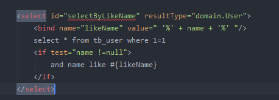

# Mybatis配置详解

[toc]

## 1.  全局配置文件  SqlMapConfig.xml

## 2. mapper.xml

### 2.1 namespace  

命名空间 ，需要和 mapper接口的package 保持一致。

例如:  mapper.xml 的 namespace 为  mapper.UserMapper

对应的 mapper  接口为   mapper.UserMapper(.java)

### 2.2  select/delete/update/insert

#### 2.2.1 id

id  namespace+id  需要唯一，用来定位SQL语句。

#### 2.2.2  parameterType

参数类型，可以省略，因为参数为简单类型的时候 会自动转换，参数为POJO的时候，会自动把里面的属性放到map里面。

经过测试，及时指定参数类型为 int ，但是传入参数 POJO时，依然可以查询成功。

#### 2.2.3  resultType

定义返回的结果类型，返回集合的时候 为集合里面的元素类型。例： 返回 List\<User\> 这里为User

#### 2.2.4 #{}

使用 #{} 可以引用参数，相当于占位符 ?  

当参数类型为 简单类型或者包装类的时候,可以任意，#{id} 、#{name} ...都可以， 因为只有一个参数，所以可以直接对应。

当参数类型为 POJO的时候,例如 #{id} 此时，需要 POJO里面有id 这个属性，或者 getId() 这个方法。

进行输入映射的时候，会对参数进行类型解析（如果是String类型，那么SQL语句会自动加 上’’）

通过反射获取数据的---StaticSqlSource 

#### 2.2.5 ${}

使用 ${}  引用参数时相当于 + 号，所以可以用来做动态SQL查询，分页之类的

当参数类型为 简单类型或者包装类的时候，只能是 ${value}

当参数类型为 POJO的时候,例如 ${id} 此时，需要 POJO里面有id 这个属性，或者 getId() 这个方法。

由于是使用 + 号，有SQL注入的风险(OR 1=1)。

进行输入映射的时候，将参数原样输出到SQL语句中

是通过OGNL表达式会随着对象的嵌套而相应的发生层级变化 --DynamicSqlSource 

#### 2.2.6  模糊查询

写法1：`like '%${name}%'`  可能导致SQL注入

写法2： `name like "%"#{name}"%"`

写法3： concat('%',#{name},'%')

写法4： 使用bind标签

