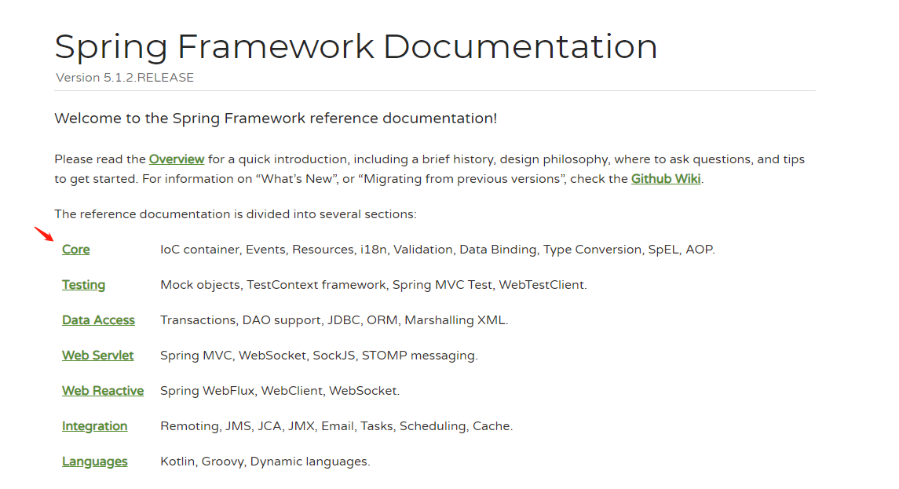
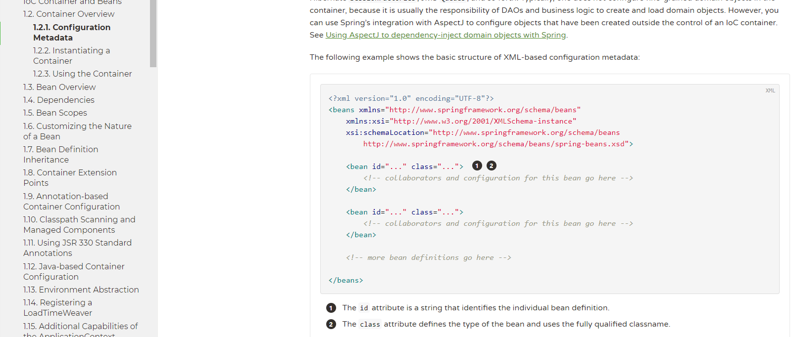

# 寻找applicationContext.xml的约束

## a. 4.2.0

spring-framework-4.2.0.RELEASE/docs/spring-framework-reference/html/xsd-configuration.html

```xml
<?xml version="1.0" encoding="UTF-8"?>
<beans xmlns="http://www.springframework.org/schema/beans"
    xmlns:xsi="http://www.w3.org/2001/XMLSchema-instance"
    xsi:schemaLocation="
        http://www.springframework.org/schema/beans http://www.springframework.org/schema/beans/spring-beans.xsd">
    <!-- bean definitions here -->
</beans>
```


## b. 5.1.2

spring-framework-5.1.2.RELEASE/docs/spring-framework-reference/index.html





