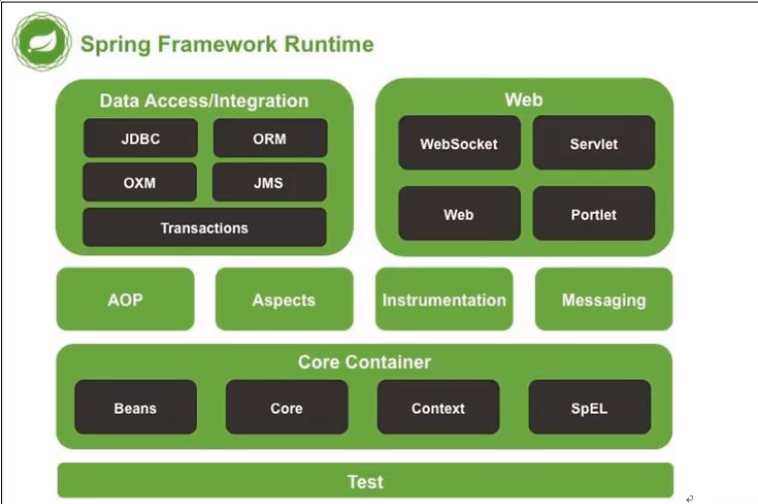
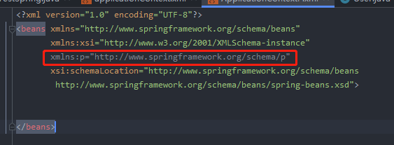

# Spring-framework

[toc]

# 1. Spring 介绍

## 1.1  Spring架构图

常说的Spring指的是Spring FrameWork



## 1.2 Spring核心概念介绍

### 1.2.1  IOC

 控制反转（Inversion of Control，缩写为*IoC*） 。对象创建权利由程序反转给Spring容器

 ### 1.2.2.DI

Dependency Injection  依赖注入 。 Spring容器创建Bean对象时，动态的将依赖对象注入到bean的组件中。

### 1.2.3 	AOP

Aspect Oriented Programming  面向切面编程。 在不修改目标对象源码的情况下，增强IOC容器中，bean的功能

### 1.2.4 Spring容器

Spring 容器指的就是ioc容器，底层也就是一个BeanFactory

- BeanFactory (已经过时,是一个顶层接口，功能比较简单)
- ApplicationContenxt （用这个）

# 2. 基于XML配置的使用

## 2.1 IOC 配置

在 Spring 的xml中，通过一个bean标签完成ioc的配置。

###  2.1.1 bean 标签

用于配置被Spring容器管理的bean的信息。 如果没有指定constructor-arg ，则使用默认的无参构造。

#### 2.1.1.1 id  

唯一标识，可以用于获取对象

#### 2.1.1.2 class 

  完整类名，用于使用反射创建对象，默认情况下，使用无参构造，可以配合 constructor-arg ，来调用指定的构造方法

#### 2.1.1.3 init-method 

指定类的初始化方法

#### 2.1.1.4 destroy-method 

​	指定类的销毁方法。比如DataSource的配置中，一般要指定 `destroy-method="close"`

#### 2.1.1.5 scope 

 指定对象的生存周期,有个对应的注解 `@Scope`。

**singleton**   单例模式从容器启动到第一次被请求而实例化开始 ， 只要容器不销毁或退出，该类型的bean的单一实例就会一直存活.

**prototype**   Spring容器会 每次都重新生成一个新的对象给请求方 ，并不会保留这个对象的引用。

**request **    request，session和global session类型只实用于web程序，通常是和XmlWebApplicationContext共同使用。  Spring容器会为每个HTTP请求创建一个全新的RequestPrecessor对象，当请求结束后，该对象的生命周期即告结束，**如同java web中request的生命周期**

**session**  对于web应用来说，放到session中最普遍的就是用户的登录信息 ，Spring容器会为每个独立的session创建属于自己的全新的UserPreferences实例，比request scope的bean会存活更长的时间，其他的方面没区别，**如同java web中session的生命周期**。

**global session**  global session只有应用在基于porlet的web应用程序中才有意义，它映射到porlet的global范围的session，如果普通的servlet的web 应用中使用了这个scope，容器会把它作为普通的session的scope对待。 

## 5. Spring创建对象的方式

### 5.1默认使用无参构造 (通常)

### 5.2 使用静态工厂模式

```xml
<bean name="user" class="com.company.factory.UserFactory" factory-method="createUser"/>
```

```java
public class UserFactory {
    public static User createUser(){
        System.out.println("静态工厂");
        return  new User();
    }
}
```

### 5.3使用实例工厂模式

```xml
<bean name="userFactory" class="com.company.factory.UserFactory" />
<bean name="user2" factory-bean="userFactory" factory-method="createUser2"/>
```

```java
public class UserFactory {
    public User createUser2(){
        System.out.println("实例工厂");
        return  new User();
    }
}
```

默认情况下，Spring创建对象是单例， 即(scope="singleton")，可以修改为 prototype 去掉单例

```xml
<bean name="user2" factory-bean="userFactory" factory-method="createUser2" scope="prototype"/>
```

#### 

## 6. 在Spring配置文件中引入其它路径的Spring配置文件

Spring-config.xml

```xml
<bean name="user5" class="com.company.domain.User"/>
```

applicationContext.xml

```xml
<import resource="com/company/config/Spring-config.xml" />
```

## 7. 注入方式(基本类型和String)

### 7.1 set方法注入

set方法注入的属性需要有对应的set方法，value要注意类型匹配

```xml
<bean name="user" class="com.company.domain.User" >
	<property name="name" value="userName"/> 
    <property name="id" value="18"/>
    <property name="user" ref="user"/>  <!-- 这里是引用类型，引用了一个bean -->
</bean>
```

### 7.2 构造方法注入

```java
public class Car {
    private String name;
    private String color;

    public Car(String color, String name) {
        this.name = name;
        this.color = color;
    }
```

```xml
<bean name="car" class="com.company.domain.Car">
	<constructor-arg name="color" value="红色" />
    <constructor-arg name="name" value="奥迪" />
</bean>
```

  **constructor-arg**  还有两个字段: **type**  参数的类型 ,  **index**  参数的位置，从0开始,如果有index，可以没有name(不建议就是了)

### 7.3 p名称空间注入

需要先加入约束头:

```xml
<?xml version="1.0" encoding="UTF-8"?>
<beans xmlns="http://www.springframework.org/schema/beans"
       xmlns:xsi="http://www.w3.org/2001/XMLSchema-instance"
       xmlns:p="http://www.springframework.org/schema/p"
       xsi:schemaLocation="http://www.springframework.org/schema/beans
        http://www.springframework.org/schema/beans/spring-beans.xsd">
</beans>
```



使用: (bean需要无参构造，没有会报错，可能是写法有问题。看起来像是先new一个对象，再调用对应的set方法)

```xml
<bean name="car2" class="com.company.domain.Car" p:color="黑色" p:name="奔驰" p:car-ref="car1"/>
```

### 7.4 Spel注入

 [SpEL.md](SpEL)

## 8 注入方式（Array、List、Map、Properties）

```java
public class CollectionBean {
    private String[] arr;
    private List<User> list;
    private Map<String,Object> map;
    private Properties prop;
    //省略 get、set、toString方法
}
```

### 8.1 Array

```xml
<property name="arr">
    <array>
        <value>a</value>
        <value>b</value>
        <value>c</value>
    </array>
</property>
```

### 8.2 list

```xml
<property name="list">
    <list>
        <bean name="u1" class="xyz.zhongzj.domain.User" >
            <property name="name" value="u1"/>
            <property name="id" value="1"/>
        </bean>
        <bean name="u2" class="xyz.zhongzj.domain.User" >
            <property name="name" value="u2"/>
            <property name="id" value="2"/>
        </bean>
        <bean name="u3" class="xyz.zhongzj.domain.User" >
            <property name="name" value="u3"/>
            <property name="id" value="3"/>
        </bean>
    </list>
```

### 8.3 Map

```xml
<property name="map">
    <map>
        <entry key="key1" value="value1" />
        <entry key="key2" value-ref="gyl"/>
    </map>
</property>
```

### 8.4 Properties

```xml
<property name="prop">
    <props>
        <prop key="name">张三</prop>
        <prop key="sex">男</prop>
    </props>
</property>
```

和Map相同的写法也是可以的:

```xml
<property name="prop">
    <map>
        <entry key="key3" value="value4" />
        <entry key="key4" value-ref="gyl"/>
    </map>
</property>
```

## 9. 在ApplicationContext.xml 中引入 配置文件 ( *.properties )

```xml
<context:property-placeholder location="classpath:db.properties"/>
```

然后可以使用 **${}** 获取里面的值

这里的classpath 指的是 src下的根目录，即编译后的 classes 。 `classpath：`只会到你的class路径中查找文件; `classpath*：`不仅包含class路径，还包括jar文件中(class路径)进行查找，会从所有的`calsspath`中加载。当项目中有多个`classpath`路径，并同时加载多个`classpath`路径下的文件，*就发挥了作用，如果不加*，则表示仅仅加载第一个`classpath`路径。

在多个`classpath`中存在同名资源，都需要加载，  那么用`classpath:`只会加载第一个，这种情况下也需要用`classpath*:`前缀

**注意**：用`classpath*:`需要遍历所有的`classpath`，所以加载速度是很慢的，因此，在规划的时候，应该尽可能规划好资源文件所在的路径，尽量避免使用 `classpath*``

``**/`:表示任意目录；

`**/applicationContext-*.xml`：表示任意目录下的以`applicationContext-`开头的XML文件。

