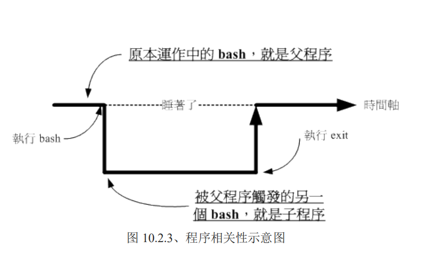
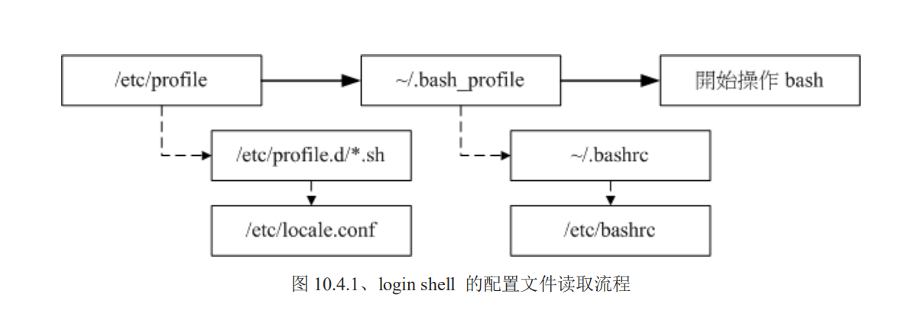

# 认识与学习BASH

### 1. shell的 种类:(可以通过 /etc/shells 获取)

- /bin/sh (已经被 /bin/bash 所取代) 
-  /bin/bash (就是 Linux 预设的 shell)
-  /bin/tcsh (整合 C Shell ，提供更多的功能) 
- /bin/csh (已经被 /bin/tcsh 所取代)

当用户登录系统时，系统会给一个shell来进行工作，这个shell 记录在 /etc/passwd里面

### 2.history

可以通过 history来查询 命令历史记录，当前的记录保存在内存里， 在退出登录后，会写入到 ~/.bash_history里面。不过history 可以看到本次的登录的命令

### 3. type

通过 type 可以判断命令是否是 bash内建。可以用来查找命令路径。比如： type java

### 4.快捷键

| 组合键   | 功能                        |
| -------- | --------------------------- |
| ctrl+u/k | 删除光标前面/后面的所有字符 |
| ctrl+a/e | 光标移动到最前面/最后面     |

### 5. 变量

获取变量的值 $    和  ${} 都可以

变量的定义规则：

1. 变量和变量使用=来连接

2. =两边不能有空格

3. 变量只能是字母和数字、下划线，而且开头不能是数字

4. 变量内容如果有空格，可以使用单引号或者双引号 包起来

  区别： 双引号 内的特殊字符 如 $ 可以保持原有的特性，而单引号内则是纯文本。比如：

  ```shell
  [dmtsai@study ~]$ home="$HOME"
  [dmtsai@study ~]$ echo $home
  /home/dmtsai
  [dmtsai@study ~]$ home2='$HOME'
  [dmtsai@study ~]$ echo $home2
  $HOME
  ```
  5.可以使用 反斜杠 \ 将一些特殊字符变成普通的字符，例如 空格、 $ ,等

  6.可以使用 `` 或者 $()  来执行指令，比如 

```shell
str="今天是 "`date +%Y-%m-%d`
echo $str
今天是 2020-01-14
```

7. 需要进行字符串拼接时，可以使用 "$变量" 或者 ${变量}:

	『PATH="$PATH":/home/bin』或『PATH=${PATH}:/home/bin』

8. 如果变量需要被其他子程序执行，可以使用export 使变量变成环境变量

	​	 export PATH

9. 通常 变量名 大写为系统默认变量，自定义变量使用小写
10. 使用 unset 取消变量

### 6.环境变量

使用 env 可以列出所有的环境变量

```shell
[dmtsai@study ~]$ env
HOSTNAME=study.centos.vbird <== 这部主机的主机名
TERM=xterm <== 这个终端机使用的环境是什么类型
SHELL=/bin/bash <== 目前这个环境下，使用的 Shell 是哪一个程序？
HISTSIZE=1000 <== 『记录指令的笔数』在 CentOS 默认可记录 1000 笔
OLDPWD=/home/dmtsai <== 上一个工作目录的所在
LC_ALL=en_US.utf8 <== 由于语系的关系，鸟哥偷偷丢上来的一个设定
USER=dmtsai <== 使用者的名称啊！
LS_COLORS=rs=0:di=01;34:ln=01;36:mh=00:pi=40;33:so=01;35:do=01;35:bd=40;33;01:cd=40;33;01:
or=40;31;01:mi=01;05;37;41:su=37;41:sg=30;43:ca=30;41:tw=30;42:ow=34;42:st=37;44:ex=01;32:
*.tar=01... <== 一些颜色显示
MAIL=/var/spool/mail/dmtsai <== 这个用户所取用的 mailbox 位置
PATH=/usr/local/bin:/usr/bin:/usr/local/sbin:/usr/sbin:/home/dmtsai/.local/bin:/home/dmtsai/bin
PWD=/home/dmtsai <== 目前用户所在的工作目录 (利用 pwd 取出！)
LANG=zh_TW.UTF-8 <== 这个与语系有关，底下会再介绍！
HOME=/home/dmtsai <== 这个用户的家目录啊！
LOGNAME=dmtsai <== 登入者用来登入的账号名称
_=/usr/bin/env <== 上一次使用的指令的最后一个参数(或指令本身)
```

#### 6.1**环境变量分析:**

##### 6.1.1HOME

用户的家目录。可以使用 cd ~  或者 cd  不带参数 回到HOME目录。

##### 6.1.2 SHELL

当前环境使用的 SHELL 。Linux 默认使用  /bin/bash

##### 6.1.3 HISTSIZE

历史命令的最大条数

##### 6.1.4 MAIL

邮件的目录

##### 6.1.5 PATH

执行文件的搜寻路径。 目录与目录之间使用 冒号 :分割，顺序是从左往右。

##### 6.1.6 LANG

语系数据

##### 6.1.7 RANDOM

随机数。 使用/dev/random作为种子(好像是这样)

可以通过 $RANDOM 获取一个随机数。随机数范围 (0-32767)

如果想要获取0~9:  

```shell
declare -i number=$RANDOM*10/32768;echo $number  # 因为先除的话，直接变成0， shell除法没有小数
```

##### 6.1.8 set

set命令可以查看所有的环境变量和自定义变量

```shell
[dmtsai@study ~]$ set
BASH=/bin/bash <== bash 的主程序放置路径
BASH_VERSINFO=([0]="4" [1]="2" [2]="46" [3]="1" [4]="release" [5]="x86_64-redhat-linux-gnu")
BASH_VERSION='4.2.46(1)-release' <== 这两行是 bash 的版本啊！
COLUMNS=90 <== 在目前的终端机环境下，使用的字段有几个字符长度
HISTFILE=/home/dmtsai/.bash_history <== 历史命令记录的放置文件，隐藏档
HISTFILESIZE=1000 <== 存起来(与上个变量有关)的文件之指令的最大纪录笔数。
HISTSIZE=1000 <== 目前环境下，内存中记录的历史命令最大笔数。
IFS=$' \t\n' <== 预设的分隔符
LINES=20 <== 目前的终端机下的最大行数
MACHTYPE=x86_64-redhat-linux-gnu <== 安装的机器类型
OSTYPE=linux-gnu <== 操作系统的类型！
PS1='[\u@\h \W]\$ ' <== PS1 就厉害了。这个是命令提示字符，也就是我们常见的
 [root@www ~]# 或 [dmtsai ~]$ 的设定值啦！可以更动的！
PS2='> ' <== 如果你使用跳脱符号 (\) 第二行以后的提示字符也
$ <== 目前这个 shell 所使用的 PID
? <== 刚刚执行完指令的回传值。
...
# 有许多可以使用的函式库功能被鸟哥取消啰！请自行查阅！
```

**比较重要的有:**

- PS1  命令提示字符   [\u@\h \W]\$   ([dmtsai@study ~]$ )

	- \d ：可显示出『星期 月 日』的日期格式，如："Mon Feb 2"
- \H ：完整的主机名。举例来说，鸟哥的练习机为『study.centos.vbird』 
	
	-  \h ：仅取主机名在第一个小数点之前的名字，如鸟哥主机则为『study』后面省略
- \t ：显示时间，为 24 小时格式的『HH:MM:SS』  \T ：显示时间，为 12 小时格式的『HH:MM:SS』 
	
	- \A ：显示时间，为 24 小时格式的『HH:MM』 
- \@ ：显示时间，为 12 小时格式的『am/pm』样式
	
	- \u ：目前使用者的账号名称，如『dmtsai』；
- \v ：BASH 的版本信息，如鸟哥的测试主机版本为 4.2.46(1)-release，仅取『4.2』显示
	
	- \w ：完整的工作目录名称，由根目录写起的目录名称。但家目录会以 ~ 取代；
- \W ：利用 basename 函数取得工作目录名称，所以仅会列出最后一个目录名。
	
	- \# ：下达的第几个指令。
-  \$ ：提示字符，如果是 root 时，提示字符为 # ，否则就是 $ 啰
	
- $ 当前shell的PID

- ?  返回上一个命令的返回值

- OSTYPE, HOSTTYPE, MACHTYPE：(主机硬件与核心的等级)

	```SHELL
	echo $OSTYPE  $HOSTTYPE $MACHTYPE
	linux-gnu x86_64 x86_64-redhat-linux-gnu
	```
	
	

##### **6.1.9 export**

自定义变量转环境变量



如上所示，我们在原本的 bash 底下执行另一个 bash ，结果操作的环境接口会跑到第二个 bash 去 (就是子程序)， 那原本的 bash 就会在暂停的情况 (睡着了，就是 sleep)。整个指令运作的环境是实线的部分！若要回到原本的 bash 去， 就只有将第二个 bash 结束掉 (下达 exit 或 logout) 才行。

子程序仅会继承父程序的环境变量， 子程序不会继承父程序的自定义变量啦！所以你在原本 bash 的自定义变量在进入了子程序后就会消失不见，一直到你离开子程序并回到原本的父程序后，这个变量才会又出现！

export 用于把自定义变量提升为环境变量，如果 不带参数，则会列出来当前的环境变量（包括被export提升为环境变量的）

##### 6.1.10 locale

locale 不带参数 查询当前语系

locale -a 列出所有支持的语系

```shell
[dmtsai@study ~]$ locale <==后面不加任何选项与参数即可！
LANG=en_US <==主语言的环境
LC_CTYPE="en_US" <==字符(文字)辨识的编码
LC_NUMERIC="en_US" <==数字系统的显示讯息
LC_TIME="en_US" <==时间系统的显示数据
LC_COLLATE="en_US" <==字符串的比较与排序等
LC_MONETARY="en_US" <==币值格式的显示等
LC_MESSAGES="en_US" <==讯息显示的内容，如菜单、错误讯息等
LC_ALL= <==整体语系的环境
```

tty1-tty6 字符界面，出现乱码时，可试着将语系换成 en_US.utf8，说不定可以解除乱码。通过远程工具连接时，一般可以正常显示中文。 语系文件放在 /usr/lib/locale/ 中

系统默认语系在 /etc/locale.conf  中定义。

#### 6.2 read, array,declare

##### 6.2.1 read

read 读取键盘输入。

```shell
[dmtsai@study ~]$ read -t 5 -p '5s 内输入：' input
5s 内输入：fjklsjkfsd
[dmtsai@study ~]$ echo $input
fjklsjkfsd
```

其中 -p  和 - t 都可以省略。   p 指定提示信息。 t 指定等待时间。


##### 6.2.2 declare/typeset

一样的功能，声明变量类型 。不带参数的情况下，会列出所有的变量。

用法： 

```shell
declare [-aixr] variable
```


-a 数组类型

-i 整数类型

-x 和export 一样，声明为环境变量

-r 只读变量。不可修改，也不可被unset

-p  可以列出变量的定义。

将 - 换成 + 可以取消定义。

##### 6.2.3 array
  数组定义: var[0]="smal min"
  使用：  `echo ${var[0]]} `
##### 6.2.4 ulimit
  ulimit [-SHacdfltu] [配额]   本次登录有效。
 选项与参数：
	-H ：hard limit ，严格的设定，必定不能超过这个设定的数值；
	-S ：soft limit ，警告的设定，可以超过这个设定值，但是若超过则有警告讯息。在设定上，通常 soft 会比 hard 小，举例来说，soft 可设定为 80 而 hard设定为 100，那么你可以使用到 90 (因为没有超过 100)，但介于 80~100 之间时， 系统会有警告讯息通知你！
	-a ：后面不接任何选项与参数，可列出所有的限制额度；0 表示无限制
	-c ：当某些程序发生错误时，系统可能会将该程序在内存中的信息写成文件(除错用)，这种文件就被称为核心文件(core file)。此为限制每个核心文件的最大容量。
	-f ：此 shell 可以建立的最大文件容量(一般可能设定为 2GB)单位为 Kbytes 。使用这个，可以减少，不能增大。
	-d ：程序可使用的最大断裂内存(segment)容量；
	-l ：可用于锁定 (lock) 的内存量
	-t ：可使用的最大 CPU 时间 (单位为秒)
	-u ：单一用户可以使用的最大程序(process)数量。

##### 6.2.5 **Optional**

**变量字符串的截取**

**变量字符串的替换**

  	${var/src/target}   替换一个字符串

​		${var//src/target}  替换所有的字符串

```shell
[dmtsai@study ~]$ str=abcaabbcc
[dmtsai@study ~]$ echo ${str/a/Z}
Zbcaabbcc
[dmtsai@study ~]$ echo ${str//a/Z}
ZbcZZbbcc
```

| 变量设定方式                                             | 说明                                                         |
| -------------------------------------------------------- | ------------------------------------------------------------ |
| ${变量#关键词}<br/>${变量##关键词}                       | 若变量内容从头开始的数据符合『关键词』，则将符合的最短数据删除<br/>若变量内容从头开始的数据符合『关键词』，则将符合的最长数据删除 |
| ${变量%关键词}<br/>${变量%%关键词}                       | 若变量内容从尾向前的数据符合『关键词』，则将符合的最短数据删除<br/>若变量内容从尾向前的数据符合『关键词』，则将符合的最长数据删除 |
| ${变量/旧字符串/新字符串}<br/>${变量//旧字符串/新字符串} | 若变量内容符合『旧字符串』则『第一个旧字符串会被新字符串取代』<br/>若变量内容符合『旧字符串』则『全部的旧字符串会被新字符串取代』 |

**变量的测试：**

```shell
[dmtsai@study ~]$ echo $aaa
			#aaa 未定义
[dmtsai@study ~]$ echo ${aaa-bbb}
bbb    # aaa未定义，所以显示 bbb
[dmtsai@study ~]$ aaa=1111  #定义aaa
[dmtsai@study ~]$ echo ${aaa-bbb}
1111   #aaa已定义，不显示bbb
```

| 变量设定方式     | str 没有设定          | str 为空字符串        | str 已设定非为空字符串 |总结|
| ---------------- | --------------------- | --------------------- | ---------------------- |----------------|
| var=${str-expr}  | var=expr              | var=                  | var=$str               |str定义了就是str，没有定义就是 expr|
| var=${str:-expr} | var=expr              | var=expr              | var=$str               |str定义了，且非空才是str|
| var=${str+expr}  | var=                  | var=expr              | var=expr               ||
| var=${str:+expr} | var=                  | var=                  | var=expr               ||
| var=${str=expr}  | str=expr<br/>var=expr | str 不变<br/>var=     | str 不变<br/>var=$str  ||
| var=${str:=expr} | str=expr<br/>var=expr | str=expr<br/>var=expr | str 不变<br/>var=$str  ||
| var=${str?expr}  | expr 输出至 stderr    | var=                  | var=$str               ||
| var=${str:?expr} | expr 输出至 stderr    | expr 输出至 stderr    | var=$str               ||

## 7. 命令别名与历史命令

### 7.1 alias  

alias不带别名可以查看已经定义的所有的别名

unalias 可以取消别名

### 7.2 history

history n   列出最近的n笔命令记录

history -c  清除history 记录（内存里面的，不包括 ~/.bash_history里面的）

history -a  [file] 将历史记录，写入到文件中去。没有指定file则写入 .bash_history 中

history -r  [file] 从file中将内容读取到这个shell的history的内存中

history -w [file]  将目前的history的内存中的记录写入到 文件中去


!number 执行history中对应的那笔指令

!command  执行，最近执行的command开头的指令

!! 执行上一条指令

同一个用户，比如root，开多个bash登录的时候，历史记录都会保存在内存里面，然后注销的时候才保存，这样会导致最后注销的那个将之前的记录覆盖掉。

history无法记录命令下达的时间，可以通过 ~/.bash_logout 来进行history的记录，并加上	date来增加时间


## 8. Bash Shell的操作环境

## 8.1 指令搜寻路径

使用 type -a  指令  即可看到

1. 以相对/绝对路径执行指令，例如『 /bin/ls 』或『 ./ls 』；
2. 由 alias 找到该指令来执行；
3. 由 bash 内建的 (builtin) 指令来执行；
4. 透过 $PATH 这个变量的顺序搜寻到的第一个指令来执行


### 8.2 bash的欢迎信息

/etc/issue  ssh或者tty 登录后可以看到

/etc/issue.net  telnet 登录后可以看到

/etc/motd  可以让用户登录后看到的信息（包括root）

issue的规则：

```
\d 本地端时间的日期；
\l 显示第几个终端机接口；
\m 显示硬件的等级 (i386/i486/i586/i686...)； \n 显示主机的网络名称；
\O 显示 domain name； \r 操作系统的版本 (相当于 uname -r)
\t 显示本地端时间的时间；
\S 操作系统的名称；
\v 操作系统的版本。
```

### 8.3 bash的配置文件

login shell  : 取得bash时，需要完整的登录流程。(tty1-tty6)

non-login shell :   取得bash时，不需要重复登录。比如在桌面 右键打开终端，在bash环境下，输入bash。获得的新的bash。

#### 8.3.1 login shell 读取 两个配置：

	1.  /etc/profile
 	2.  ~/.bash_profile 或 ~/.bash_login 或 ~/.profile

/etc/profile 还会按顺序加载以下文件:

- /etc/profile.d/*.sh   要求要有r的权限。如果有需要加入的全局配置，应该加到这里面，而不是/etc/profile里面
- /etc/locale   语系配置文件 从 /etc/profile.d/lang.sh 调用
- /usr/share/bash-completion/completions/*   tab补齐相关，从/etc/profile.d/bash_completion.sh 调用

在 /etc/profile 之后，

 会依次读取  ~/.bash_profile  ,如果不存在就读取  ~/.bash_login   , 还不存在就读取 ~/.profile




   

/etc/profile  和 ~/.bash_profile  都是 login  shell的时候才会读取。 如果修改了，又不想重新登录，可以使用source  命令读取，或者  . 读取

#### 8.3.2 non-login shell

non-login-shell 取得时，只会读取 ~/.bashrc   

根据 ~/.bashrc 代码，可知， ~/.bashrc 会读取  /etc/bashrc ,/etc/ bashrc 会读取  /etc/profile.d/*.sh

如果bash提示字符出问题了。有可能就是 ~/.bshrc出问题了。

#### 8.3.3 其他配置文件

##### 8.3.3.1 /etc/man_db.conf

 和man的查找路径 有关

##### 8.3.3.2 ~/.bash_history

历史命令记录

##### 8.3.3.3 ~/.bash_logout

注销bash后，系统再执行的动作。

