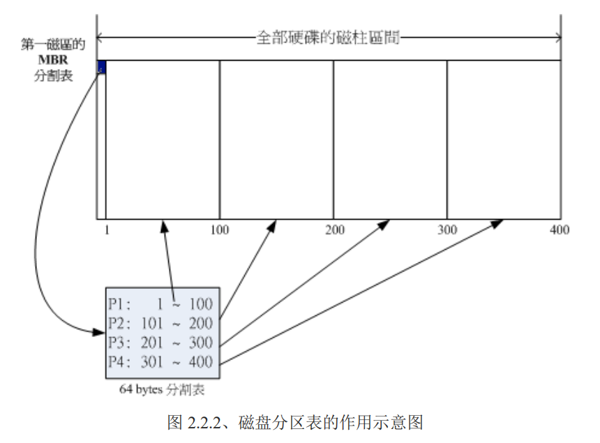
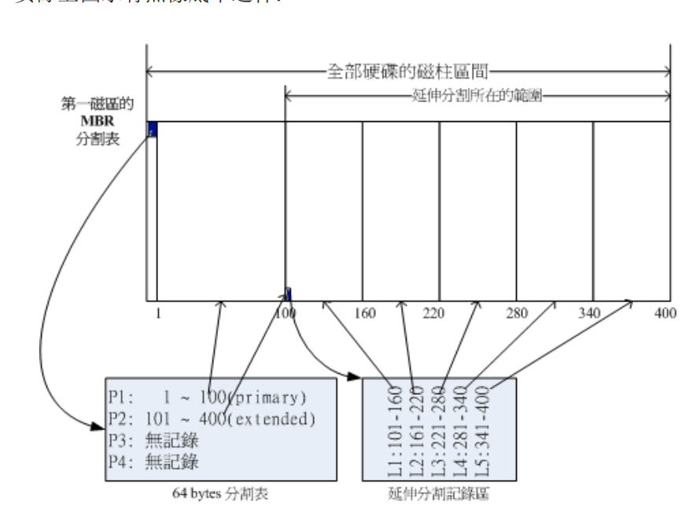
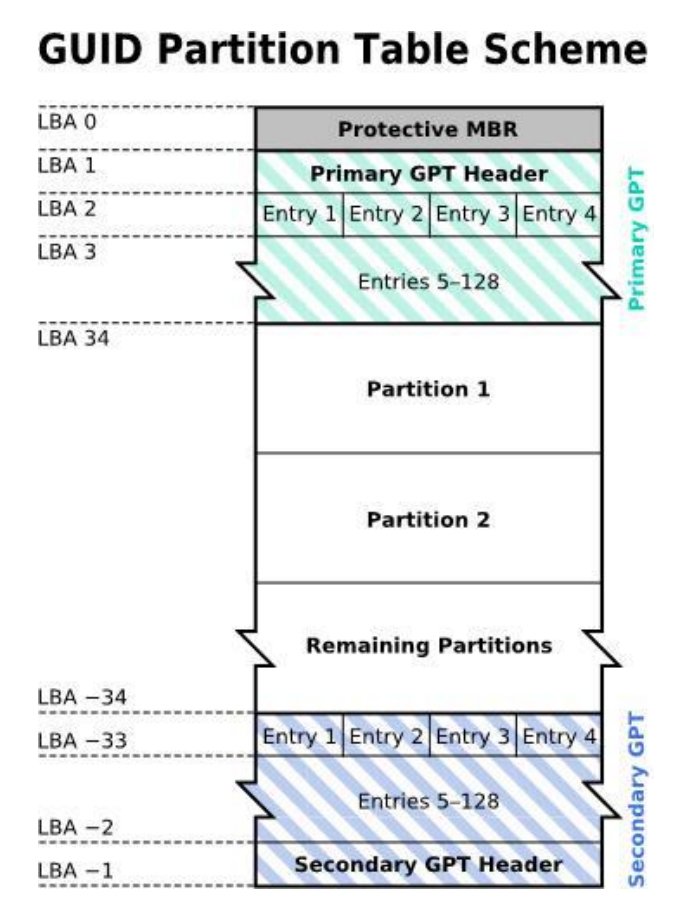

# 主机规划与磁盘分区

## 1. 硬件支持

- Red Hat 的硬件支持：https://hardware.redhat.com/?pagename=hcl

-  Open SuSE 的硬件支持：http://en.opensuse.org/Hardware?LANG=en_UK
-  Linux 对笔记本电脑的支援：http://www.linux-laptop.net/
-  Linux 对打印机的支持：http://www.openprinting.org/
-  Linux 硬件支持的中文 HowTo：http://www.linux.org.tw/CLDP/HOWTO/hardware.html#hardware

## 2. 各种硬件装置在Linux中的文件名

| 装置              | 装置在Linux内的文件名 |
| :---------------- | --------------------- |
| SCSI/SATA/USB硬盘/USB 快闪碟 | /dev/sd[a-p]          |
| Virtl/O|/dev/vd[a-p] （主要用于虚拟机）|
|软盘驱动器| /dev/fd[0-7]|
|打印机|/dev/lp[0-2] 25针打印机 /dev/usb/lp[0-15] (USB界面)|
|鼠标|/dev/input/mounse[0-15] (通用)  /dev/psaux （PS/2 界面） /dev/mouse (当前鼠标)|
|CDROM/DVDROM|/dev/scd[0-1] (通用)  /dev/sr[0-1]（通用，CentOS较常见） /dev/cdrom (当前CDROM)|
|磁带机|/dev/ht0 (IDE 界面) /dev/st0 (SATA/SCSI 界面) /dev/tape (当前磁带)|
|IDE 硬盘机|/dev/hd[a-d] (旧式系统才有)|
|RAID|/dev/md[0-127]|

更多: https://www.kernel.org/doc/Documentation/devices.txt

 Virtualbox 官网 (https://www.virtualbox.org)

Virtualbox 官网教学 (https://www.virtualbox.org/manual/ch01.html)

Fedora 教学 http://docs.fedoraproject.org/en-US/Fedora/13/html/Virtualization_Guide/part-Virtualization-Virtualization_Reference_Guide.html

## 3.磁盘分区

### 3.1 MBR与GPT

#### 3.1.1MBR

**MBR**(Master Boot Record, 主要开机纪录区) 主引导记录。开机管理程序纪录区与分区表则通通放在磁盘的第一个扇区，这个扇区通常是 512bytes 的大小 。其中：

- 主要启动记录区(Master Boot Record, MBR)：可以安装开机管理程序的地方，有 446 bytes
- 分区表(partition table)：记录整颗硬盘分区的状态，有 64 bytes

由于分区表只有64 bytes，8个字节，记录一个分区的起始区段各需要1个字节，所以只能有4个分区。

假设上面的硬盘装置文件名为/dev/sda时，那么这四个分区槽在Linux系统中的装置文件名如下所示， 

重点在于档名后面会再接1个数字，这个数字与该分区槽所在的位置有关喔！ 

- P1:/dev/sda1 

- P2:/dev/sda2 

- P3:/dev/sda3 

- P4:/dev/sda4

其实所谓的『分区』只是针对那个 64 bytes 的分区表进行设定而已！ 

- 硬盘默认的分区表仅能写入四组分区信息 

-  这四组分区信息我们称为主要(Primary)或延伸(Extended)分区槽 

- 分区槽的最小单位『通常』为磁柱(cylinder) 

- 当系统要写入磁盘时，一定会参考磁盘分区表，才能针对某个分区槽进行数据的处理

**为什么要分区:**

1. 数据的安全性：
因为每个分区槽的数据是分开的！所以，当你需要将某个分区槽的数据重整时，例如你要将计算机中
Windows 的 C 槽重新安装一次系统时， 可以将其他重要数据移动到其他分区槽，例如将邮件、桌面数据移动到 D 槽去，那么 C 槽重灌系统并不会影响到 D 槽！ 所以善用分区槽，可以让妳的数据更安全。
2. 系统的效能考虑：
由于分区槽将数据集中在某个磁柱的区段，例如上图当中第一个分区槽位于磁柱号码 1~100 号，如此一来当有数据要读取自该分区槽时， 磁盘只会搜寻前面 1~100 的磁柱范围，由于数据集中了，将有助于数据读取的速度与效能！所以说，分区是很重要的！

**扩展分区**

利用额外的扇区来记录更多 的分区信息:

实际上延伸分区并不是只占一个区块，而是会分布在每个分区槽的最前面几个扇区来 记载分区信息的！只是为了方便读者记忆， 鸟哥在上图就将他简化了！有兴趣的读者可以到底下的连结瞧一瞧实 际延伸分区的纪录方式： http://en.wikipedia.org/wiki/Extended_boot_record

MBR 主要分区、延伸分区与逻辑分区的特性我们作个简单的定义啰： 

-  主要分区与延伸分区最多可以有四笔(硬盘的限制) 

-  延伸分区最多只能有一个(操作系统的限制) 

-  逻辑分区是由延伸分区持续切割出来的分区槽； 

- 能够被格式化后，作为数据存取的分区槽为主要分区与逻辑分区。延伸分区无法格式化； 

- 逻辑分区的数量依操作系统而不同，在 Linux 系统中 SATA 硬盘已经可以突破 63 个以上的分区限制

**MBR的限制:**

- 操作系统无法抓取到 2.2T 以上的磁盘容量！
-  MBR 仅有一个区块，若被破坏后，经常无法或很难救援。
-  MBR 内的存放开机管理程序的区块仅 446bytes，无法容纳较多的程序代码。

#### 3.1.2 GPT

GPT 将磁盘所有区块以此 LBA(预设为 512bytes 喔！) 来规划，而第一个 LBA 称为 LBA0 (从
0 开始编号)。GPT 使用了前面 34 个 LBA 区块来纪录分区信息，使用最后33个LBA作为另一个备份。

上述图示的解释说明如下：

-  LBA0 (MBR 相容区块)

	​     与 MBR 模式相似的，这个兼容区块也分为两个部份，一个就是跟之前 446 bytes 相似的区块，储存了第一阶段的开机管理程序！ 而在原本的分区表的纪录区内，这个兼容模式仅放入一个特殊标志的分区，用来表示此磁盘为 GPT 格式之意。而不懂 GPT 分区表的磁盘管理程序， 就不会认识这颗磁盘，除非用户有特别要求要处理这颗磁盘，否则该管理软件不能修改此分区信息，进一步保护了此磁盘喔！
	
- LBA1 (GPT 表头纪录)
       这个部份纪录了分区表本身的位置与大小，同时纪录了备份用的 GPT 分区 (就是前面谈到的在最后 34 个 LBA 区块) 放置的位置， 同时放置了分区表的检验机制码 (CRC32)，操作系统可以根据这个检验码来判断 GPT 是否正确。若有错误，还可以透过这个纪录区来取得备份的 GPT(磁盘最后的那个备份区块) 来恢复 GPT 的正常运作！
	
-  LBA2-33 (实际纪录分区信息处) 

	​      从 LBA2 区块开始，每个 LBA 都可以纪录 4 笔分区纪录，所以在默认的情况下，总共可以有 4*32 = 128 笔分区纪录喔！因为每个 LBA 有 512bytes，因此每笔纪录用到 128 bytes 的空间，除了每笔纪录所需要的标识符与相关的纪录之外，GPT 在每笔纪录中分别提供了 64bits 来记载开始/结束的扇区号码，因此，GPT 分区表对于单一分区槽来说， 他的最大容量限制就会在『 264 * 512bytes = 263 * 1Kbytes = 233*TB = 8 ZB 』，要注意 1ZB = 230TB 啦！ 你说有没有够大了？
	
#### 3.2.1 开机流程
整个开机流程到操作系统之前的动作应该是这样的:

1. BIOS：开机主动执行的韧体，会认识第一个可开机的装置；
2. MBR：第一个可开机装置的第一个扇区内的主要启动记录区块，内含开机管理程序；
3. 开机管理程序(boot loader)：一支可读取核心文件来执行的软件；
4. 核心文件：开始操作系统的功能...

由于 LBA0 仅提供第一阶段的开机管理程序代码，因此如果你使用类似 grub 的开机管理程序的话，那么就得要额外分区出一个『 BIOS boot 』的分区槽， 这个分区槽才能够放置其他开机过程所需的程序代码！在 CentOS 当中，这个分区槽通常占用 2MB 左右而已。

由于 UEFI 已经克服了 BIOS 的 1024 磁柱的问题，因此你的开机管理程序与核心可 以放置在磁盘开始的前 2TB 位置内即可！加上之前提到的 BIOS boot 以及 UEFI 支持的分区槽，基本上你的 /boot 目录几乎都是 /dev/sda3 之后的号码了！这样开机还是没有问题的！所以要注意喔！与以前熟悉的分区状况 已经不同， /boot 不再是 /dev/sda1 啰！很有趣吧！ 

## 4.挂载点和分区规划

 初次接触 Linux的，只要分区『 / 』及『swap』即可，预留一个备用的剩余磁盘容量！

基本的分区模式：

- 仅分区出根目录与内存置换空间( / & swap )即可。 然后再预留一些剩余的磁盘以供后续的练习之用
- 在默认的 CentOS 环境中，底下的目录是比较符合容量大且(或)读写频繁的目录啰：
	-  /boot
	-  /home
	-  /var
	-  Swap

## 5.**重点回顾**
- 新添购计算机硬件配备时，需要考虑的角度有『游戏机/工作机』、『效能/价格比』、『效能/消耗瓦数』、『支持
度』等；
- 旧的硬件配备可能由于保存的问题或者是电子零件老化的问题，导致计算机系统非常容易在运作过程中出
现不明的当机情况
- Red Hat 的硬件支持：https://hardware.redhat.com/?pagename=hcl
-  在 Linux 系统中，每个装置都被当成一个文件来对待，每个装置都会有装置文件名。
-  磁盘装置文件名通常分为两种，实际 SATA/USB 装置文件名为/dev/sd[a-p]，而虚拟机的装置可能为
/dev/vd[a-p]
-  磁盘的第一个扇区主要记录了两个重要的信息，分别是： (1)主要启动记录区(Master Boot Record, MBR)：可以安装开机管理程序的地方，有 446 bytes (1)分区表(partition table)：记录整颗硬盘分区的状态，有 64 bytes；  磁盘的 MBR 分区方式中，主要与延伸分区最多可以有四个，逻辑分区的装置文件名号码，一定由 5 号开始；
-  如果磁盘容量大于 2TB 以上时，系统会自动使用 GPT 分区方式来处理磁盘分区。
-  GPT 分区已经没有延伸与逻辑分区槽的概念，你可以想象成所有的分区都是主分区！  某些操作系统要使用 GPT 分区时，必须要搭配 UEFI 的新型 BIOS 格式才可安装使用。
-  开机的流程由：BIOS-->MBR-->-->boot loader-->核心文件；  boot loader 的功能主要有：提供选单、加载核心、转交控制权给其他 loader
-  boot loader 可以安装的地点有两个，分别是 MBR 与 boot sector
-  Linux 操作系统的文件使用目录树系统，与磁盘的对应需要有『挂载』的动作才行；
-  新手的简单分区，建议只要有/及 swap 两个分区槽即可

