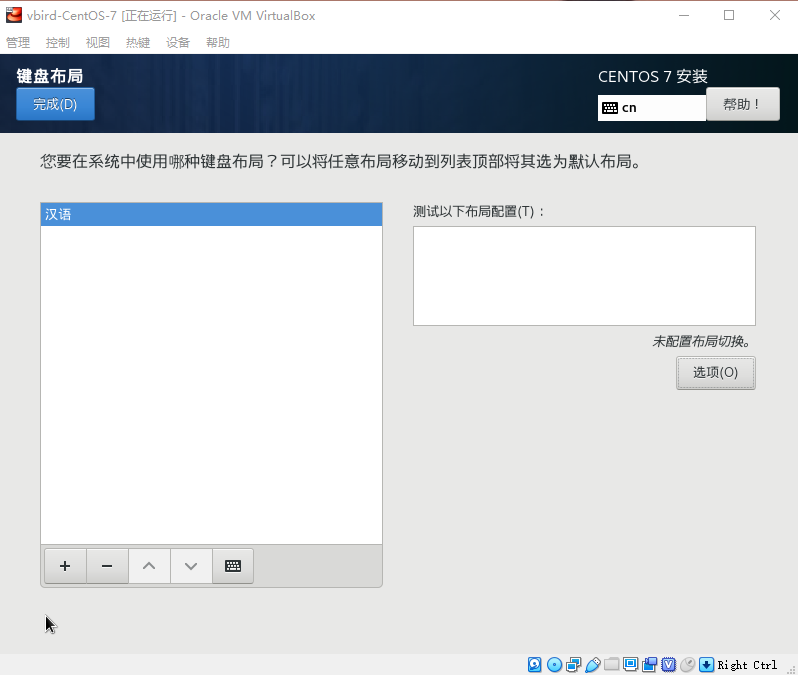
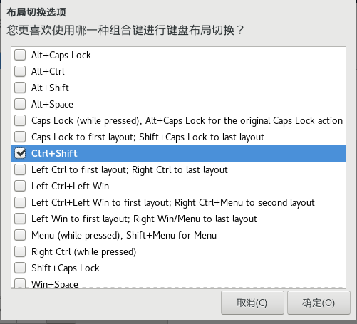
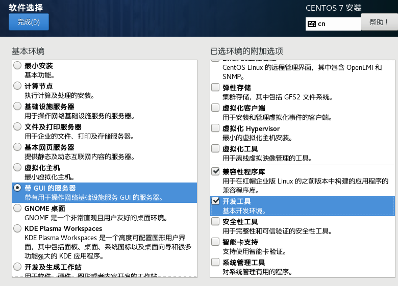

# 安装CentOS 7.x

## 1.准备工作

### 1.1分区规划(40G)

| 所需目录/装置 | 磁盘容量 | 文件系统   | 分区格式 |
| ------------- | -------- | ---------- | -------- |
| BIOS boot     | 2MB      | 系统自定义 | 主分区   |
|/boot |1GB |xfs| 主分区 |
|/ |10GB| xfs| LVM 方式 |
|/home| 5GB| xfs| LVM 方式 |
|swap| 1GB| swap| LVM 方式|

### 1.2 ip 配置:

​	是否使用 DHCP：无 

​	IP:192.168.1.100 

​	子屏蔽网络：255.255.255.0

​	主机名：study.centos.vbird

### 1.3 创建启动盘

UNetbootin  或者ISOtoUSB 或者使用dd

```shell
# 假设你的 USB 装置为 /dev/sdc ，而 ISO 档名为 centos7.iso 的话：
[root@study ~]# dd if=centos7.iso of=/dev/sdc
```

## 2. 开始安装

如果磁盘容量小于 2TB 的话，系统默认会使用 MBR 模式来安装,因此需要加入参数 inst.gpt 来 指定使用gpt分区。

注意： 使用vbox似乎有点问题。不知道是不是配置的问题。换VMware。就好了 。( 才怪啊。新建挂载点的时候卡死了。我哭了。似乎是检查依赖的时候卡住了，多等等吧。)

这个界面，如果点到那个按键测试了，使用 alt+c 退出，我点了半天关闭没反应。

​	记得点右边的选项设置 布局切换的快捷键。





这里如果鼠标点不了，就用上下方向键来移动，使用空格键来选择。这个确定键 好像也只能用 alt+o 来触发。




**配置网络**：

​	配置网络自动连接。

​	ipv4 设置为手动： 192.168.1.100  255.255.255.0    

​	主机名： study.centos.vbird

**新建用户**:

  dmtsai  管理员   

先提醒你自己记一下，你刚刚上面所选择的项目，包括 root 的密码等等，通通都会被纪录到 /root/anaconda-ks.cfg 这个文件内喔！ 这个文件可以提醒与协助你未来想要重建一个一模一样的系统时，就可以参考该文件来制作啰！当然，你也可以 google 一下，找 kickstart 这个关键词，会得到很多协助喔！ ^_^

**内存压力测试**

进入系统的时候，选择   Trouleshooting   -> run a memory test

会一直跑，知道按ESC停止。跑个1天的样子，还没出问题，就算稳定了。

**笔记本安装时的参数： ** 详情： http://linux.vbird.org/linux_basic/0157installcentos7.php#ps4

​	 加入这几个，可以使安装顺利一些

​	**nofb apm=off acpi=off pci=noacpi** 


## 3. 多重引导安装流程与管理

CentOS 7.x + Windows 7  200G MBR（不要加inst.gpt参数）

| Linux装置名 | Linux挂载点 | Windows装置 | 实际内容      | 文件系统 | 容量     |
| ----------- | ----------- | ----------- | ------------- | -------- | -------- |
| /dev/vda1   | /boot       | -           | Linux开机信息 | xfs      | 2g       |
| /dev/vda2   | /           | -           | Linux根目录   | xfs      | 50g      |
| /dev/vda3   | -           | C           | Windows系统盘 | ntfs     | 100g     |
| /dev/vda4   | /data       | D           | 共享数据磁盘  | vfat     | 其他剩余 |

**先安装Linux：**

​	出现安装界面时按下 <kbd>ctrl</kbd>+ <kbd>alt</kbd>+<kbd>F2</kbd> 进入shell界面 (如果找不到磁盘,检查磁盘接口是不是sata的 )  ，按<kbd>ctrl</kbd>+ <kbd>alt</kbd>+<kbd>F6</kbd>  可以切换回到图形界面。

```shell
[anaconda root@localhost /]# parted /dev/sda mklabel msdos # 建立 MBR 分区
[anaconda root@localhost /]# parted /dev/sda mkpart primary 1M 2G # 建立 /boot
[anaconda root@localhost /]# parted /dev/sda mkpart primary 2G 52G # 建立 /
[anaconda root@localhost /]# parted /dev/sda mkpart primary 52G 152G # 建立 C
[anaconda root@localhost /]# parted /dev/sda mkpart extended 152G 100% # 建立延伸分区
[anaconda root@localhost /]# parted /dev/sda mkpart logical 152G 100% # 建立逻辑分区
[anaconda root@localhost /]# parted /dev/sda print # 显示分区结果
```

再设置分区，在分区那里，将分区设置格式化，挨个挂载上去。

其它配置和前面的一样就好了。

**然后按住Windows：** 

​	使用VMware时，挂载Windows的iso，然后开机，快速按 F2 进入 Bois 设置，可以按 ctrl+alt+insert 重启虚拟机，按 - 、+ 调整顺序，按F10 保存退出。

​	注意安装磁盘 选 那个100g的即可。  如果无法使用，先删掉，再新建分区。

**修复开机管理程序：**

​	进入CentOS 的光盘的启动界面，选择  【 Troubleshooting】 -》【Rescue a CentOS system】

-》【continue】  进入字符界面，执行以下命令：

```shell
chroot /mnt/sysimage
grub2-install /dev/sda
exit
reboot
```

进入系统后，把Windows的开机菜单加入:

```shell
[root@study ~]# vim /etc/grub.d/40_custom
#!/bin/sh
exec tail -n +3 $0
# This file provides an easy way to add custom menu entries. Simply type the
# menu entries you want to add after this comment. Be careful not to change
# the 'exec tail' line above.
menuentry "Windows 7" {
 set root='(hd0,3)'
 chainloader +1
}
[root@study ~]# vim /etc/default/grub
GRUB_TIMEOUT=30 # 将 5 秒改成 30 秒长一些
...
[root@study ~]# grub2-mkconfig -o /boot/grub2/grub.cfg
```

**注意事项：**

   在Windows中，取消Linux系统文件的挂载，防止手误格式化掉了分区。


