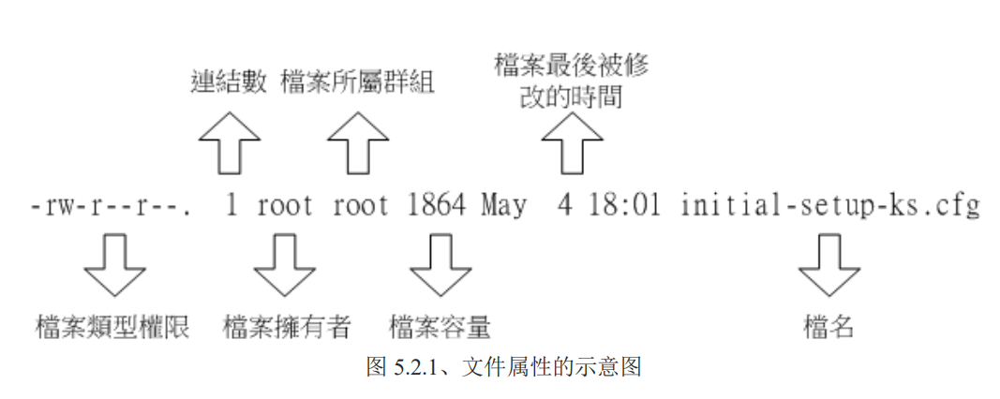

# Linux的文件权限和目录配置

## 1. 文件权限

Linux用户身份与群组记录的文件**

账号记录都保存在 /etc/passwd 

个人密码保存在 /etc/shadow

所有的组名记录在 /etc/group




第一个字符代表这个文件是『目录、文件或链接文件等等』：

- [ d ]是目录
-  [ - ]是文件
-  [ l ]是连结档(link file)
-  [ b ]表示为装置文件里面的可供储存的接口设备(可随机存取装置)； 
-  [ c ]表示为装置文件里面的串行端口设备，例如键盘、鼠标(一次性读取装置)。


如果文件的被修改的时间太久了，则会只显示年份，可以通过  ls -l --full-time 来显示

## 2.修改文件属性和权限

### 2.1 **chown** 修改 拥有者

   `chown dmtsai  -R file*`   修改文件所属用户，用户要存在。

​	 `chown root:root  -R file*`  修改文件所属组合用户。（账号名:组名,   :  可以用.代替 ）

​	`chown .root  -R file*`  只修改组

### 2.2 **chgrp** 修改所属组    

​	`chgrp  dmtsai  -R file*`   其中R 是递归的意思。 组名要存在

### 2.3 **chmod** 修改权限 ,SUID、SGID、SBIT

   修改 r、w、x  权限:

 `chmod 777 [-R]  file`

去掉 某个权限:

`chmod -x file1`

加上某个权限:

`chmod +x  file2`

不过这样会修改 所有者、组、其它  一起的 权限。

**符号类型修改权限**

​	用 u 代表 所有者(user)， g 代表 组(group) 、o 代表 其它(other)、a表示全部（all）

​	r  表示 读，w表示写、x表示执行

​	\+ 表示加入， - 表示 去掉 ， =  表示设置
```shell
chmod u=rwx,go=rx .bashrc   
chmod u-w,g-r,o-r file1
```

### 2.4 权限的意义
 **对于文件来说**
- r (read)：可读取此一文件的实际内容，如读取文本文件的文字内容等；
-  w (write)：可以编辑、新增或者是修改该文件的内容(但不含删除该文件)； 
-  x (eXecute)：该文件具有可以被系统执行的权限

**对于目录来说**

- r (read contents in directory)：
		表示具有读取目录结构列表的权限，所以当你具有读取(r)一个目录的权限时，表示你可以查询该目录下的文件名数据。 所以你就可以利用 ls 这个指令将该目录的内容列表显示出来！
- w (modify contents of directory)：
	    这个可写入的权限对目录来说，是很了不起的！ 因为他表示你具有异动该目录结构列表的权限，也就是底下这些权限：
	- 建立新的文件与目录；
	-  删除已经存在的文件与目录(不论该文件的权限为何！ 即使是root用户的文件，也可以删除) 
	-   将已存在的文件或目录进行更名；
	-  搬移该目录内的文件、目录位置。
		总之，目录的 w 权限就与该目录底下的文件名异动有关就对了啦！
- x (access directory)：
		咦！目录的执行权限有啥用途啊？目录只是记录文件名而已，总不能拿来执行吧？没错！目录不可以被执
	行，目录的  x 代表的是用户能否进入该目录成为工作目录的用途！ 所谓的工作目录(work directory)就是你目前所在的目录啦！举例来说，当你登入 Linux 时， 你所在的家目录就是你当下的工作目录。而变换目录的指令是『cd』(change directory)啰！

如果只有 r 权限，则可以获取到文件列表，但是 无法获取其他信息：

```shell
[root@study tmp]# ls -lad testing/1 
-rw-r--r--. 1 root root 0 1月  13 06:53 testing/1
[root@study tmp]# ls -lad testing/
drwxr--r--. 2 root root 15 1月  13 06:53 testing/
[root@study tmp]# su dmtsai
[dmtsai@study tmp]$ ls -lad testing/
drwxr--r--. 2 root root 15 1月  13 06:53 testing/
[dmtsai@study tmp]$ ls -la testing/
ls: 无法访问testing/.: 权限不够
ls: 无法访问testing/..: 权限不够
ls: 无法访问testing/1: 权限不够
总用量 0
d????????? ? ? ? ?            ? .
d????????? ? ? ? ?            ? ..
-????????? ? ? ? ?            ? 1
[dmtsai@study tmp]$ ls -la testing/1
ls: 无法访问testing/1: 权限不够
[dmtsai@study tmp]$ 
```

只要目录有了x权限，即可移动文件（文件权限没问题的情况），如果只有x，没有r， 则无法获取 文件夹内的文件列表（tab无法补全），但是还是可以 移动文件（摸黑操作）。


### 2.5 文件种类与扩展名
#### 2.5.1 文件种类
- 正规文件  regular file 
	就是普通文件。ls -al 查看时，第一个字符为 - 。可以分为几大类:
	1. 纯文本文档 （ASCII）
	2. 二进制文件。（一般是可执行文件，不包括脚本之类的）
	3. 数据格式文件
- 目录 directory
	第一个属性为d
- 链接 link
	（快捷方式）。第一个属性为l(小写的L)
- 设备和装置文件 device
	通常放在 /dev下面。又分为2种：
	- 区块设备块 block 。就是一些存储数据，以供系统随机存取的接口设备。比如硬盘和软盘。第一个属性为b
	- 字符设备 character。 一些串行接口设备。比如键盘鼠标等等。这些设备的特色是一次性读取。不能够截断输出。 第一个属性为c
- 资料接口文件 socket
	socket 文件。 第一个属性为s
- 数据输送文件 FIFO，pipe
	第一个属性为p，为了解决多个程序同时存取一个问题所造成的问题。
#### 2.5.2 文件扩展名
	- *.sh ： 一般是脚本或者批处理文件。
	- *Z, *.tar, *.tar.gz, *.zip, *.tgz： 经过打包的压缩文件。这是因为压缩软件分别为 gunzip, tar 等等的
	- *.html, *.php：网页相关文件，分别代表 HTML 语法与 PHP 语法的网页文件啰！	
#### 2.5.3 文件长度限制
	最大为255 byte，一个ascii占用1个，大约255个英文字母，换成中文则大约是128个
#### 2.5.4 文件名限制
	最好可以避开一些特殊字符，比如： * ? > < ; & ! [ ] | \ ' " ` ( ) { }
### 3 目录配置

目录配置依据Filesystem Hierarchy Standard (FHS) 标准。FHS重点在规范哪个目录应该存放什么样的数据。

|      | 可分享的(shareable) | 不可分享的(unshareable) |
| ---- | ------------------- | ----------------------- |
|不变的(static)		|/usr (软件放置处)			|/etc (配置文件)	|
|不变的(static)		|/opt (第三方协力软件)		|/boot (开机与核心档)	|
|可变动的(variable)	|/var/mail (使用者邮件信箱)	|/var/run (程序相关)	|
|可变动的(variable)	|/var/spool/news (新闻组)	|/var/lock (程序相关)	|


-  可分享的：可以分享给其他系统挂载使用的目录，所以包括执行文件与用户的邮件等数据， 是能够分享给网络上其他主机挂载用的目录；
-  不可分享的：自己机器上面运作的装置文件或者是与程序有关的 socket 文件等， 由于仅与自身机器有关，所以当然就不适合分享给其他主机了。
-  不变的：有些数据是不会经常变动的，跟随着 distribution 而不变动。 例如函式库、文件说明文件、系统管理员所管理的主机服务配置文件等等；
- 可变动的：经常改变的数据，例如登录文件、一般用户可自行收受的新闻组等。

事实上，FHS 针对目录树架构仅定义出三层目录底下应该放置什么数据而已:

- / (root, 根目录)：与开机系统有关；
-  /usr (unix software resource)：与软件安装/执行有关；
-  /var (variable)：与系统运作过程有关

 FHS 标准建议：根目录(/)所在分区槽应该越小越好， 且应用程序所安装的软件最好不要与根目
录放在同一个分区槽内，保持根目录越小越好。 如此不但效能较佳，根目录所在的文件系统也较不
容易发生问题。

