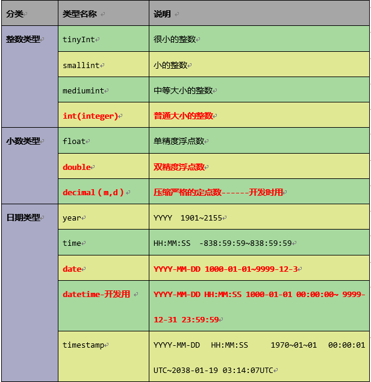
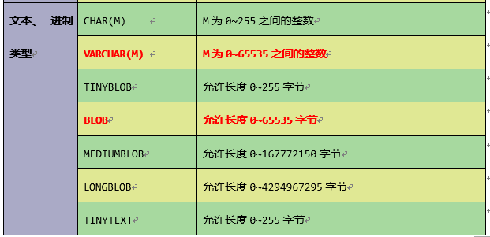

# 表操作

[toc]

## 1. 环境
**MYSQL:**  5.6

## 2. 创建表

### 2.1 示例

```mysql
CREATE TABLE test2 (
  id int(11)   PRIMARY KEY  NOT NULL AUTO_INCREMENT,
  name varchar(255) DEFAULT NULL
);
```

### 2.2 创建表

```mysql
create table 表名(
 字段名 类型(长度) 约束,
 字段名 类型(长度) 约束
);
```

### 2.3 约束

- 主键约束：primary key   (主键约束=唯一约束 + 非空约束)
- 唯一约束：unique
- 非空约束：not null

### 2.4 字段类型

#### **2.4.1 常用的字段类型**

- 数字型：int
- 浮点型：double
- 字符型：varchar（可变长字符串）
- 日期类型：
  - date（只有年月日，没有时分秒）
  - datetime（年月日，时分秒）
- boolean类型：不支持，一般使用tinyint替代（值为0和1）

#### 2.4.2 所有的字段类型






## 3. 查看表

### 3.1 查看当前数据库所有的表

```mysql
show tables;
```

### 3.2 查看指定表结构

```mysql
desc test;
```

## 4 修改表

### 4.1 添加列

```mysql
alter table 表名 add 列名 类型(长度) 约束;
```

### 4.2 修改列类型

```mysql
alter table 表名 modify 列名 类型(长度) 约束; 
```

### 4.3 修改列名称

```mysql
alter table 表名 change 旧列名 新列名 类型(长度) 约束; 
```

### 4.4 删除列

```mysql
alter table 表名 drop 列名;  
```

### 4.5 修改表名

```mysql
rename table 表名 to 新表名;  
```

### 4.6 修改字符集

```mysql
alter table 表名 character set 字符集; 
```

### 4.7 添加外键

```mysql
alter table 表名 add [constraint][约束名称] foreign key (主表外键字段) references 从
表(从表主键)  #在互联网项目中，一般情况下，不建议建立外键关系。
```

### 4.8 删除外键

```mysql
alter table 表名 drop foreign key 外键约束名称
```

## 5. 删除表

### 5.1 删除已经存在的表

```mysql
drop table test;
```

###  5.2 如果表存在则删除

```mysql
drop table if exists test
```

