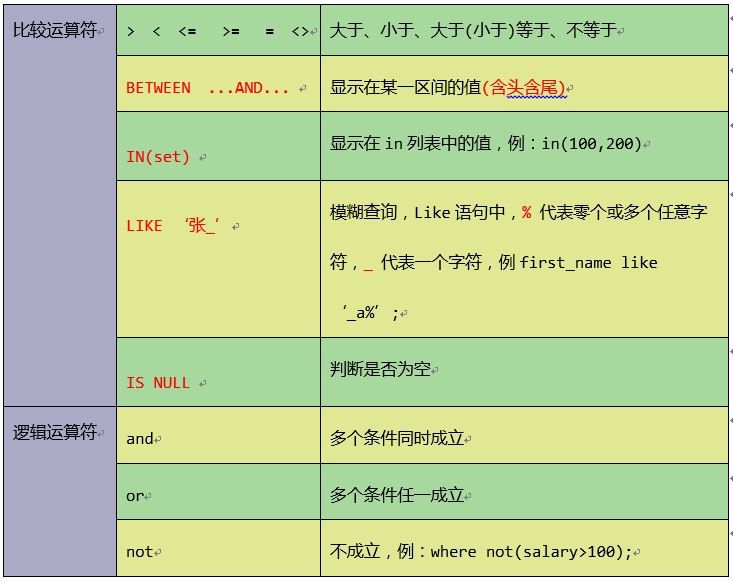

# DQL 语句

[toc]

## 1. 环境

**MYSQL：** 5.6

## 2. 测试数据

```mysql
#商品表

CREATE TABLE product2 (
    pid int PRIMARY KEY AUTO_INCREMENT, # 自增加 AUTO_INCREMENT
    pname VARCHAR(20),#商品名称
    price DOUBLE, #商品价格
    pdate date, # 日期
    cid TINYINT#分类ID
);
#目录表
create table category(
    id INT PRIMARY KEY ,
    cname varchar(100)
);
INSERT INTO product VALUES(NULL,'泰国大榴莲', 98, NULL, 1);
INSERT INTO product VALUES(NULL,'泰国大枣', 38, NULL, 1);
INSERT INTO product VALUES(NULL,'新疆切糕', 68, NULL, 2);
INSERT INTO product VALUES(NULL,'十三香', 10, NULL, 2);
INSERT INTO product VALUES(NULL,'泰国大枣', 20, NULL, 2);
insert into product values(null,'泰国大枣',98,null,20); #没有对应
insert into product values(null,'iPhone手机',800,null,30);#没有对应

INSERT INTO category VALUES(1,'国外食品');
INSERT INTO category VALUES(2,'国内食品');
INSERT INTO category VALUES(3,'国内服装'); #没有对应
```

## 3. 完整DQL语法顺序

 ```mysql
SELECT DISTINCT
 < select_list >
FROM
 < left_table > < join_type >
JOIN < right_table > ON < join_condition >
WHERE
 < where_condition >
GROUP BY
 < group_by_list >
HAVING
 < having_condition >
ORDER BY
 < order_by_condition >
LIMIT < limit_number >
 ```

## 4. 简单查询

### 4.1 简单查询语法

```mysql
SELECT 列名 FROM  表名
SELECT * FROM  表名
```

### 4.2 简单查询案例

#### 4.2.1 查询所有的列

```mysql
select * from product;#查询所有的商品
```

#### 4.2.2 查询部分列

```mysql
select pname,price from product;#查询商品名和商品价格
```

#### 4.2.3 使用表别名

```mysql
select * from product as p; # 表别名,as 可以省略
```

#### 4.2.4 使用列别名

```mysql
select pname as pn from product; #列别名,as 可以省略
```

#### 4.2.5 去重重复列

```mysql
select distinct price from product;
```

#### 4.2.6 对查询结果进行运算

```mysql
select pname,price+10 from product;
```

## 5. 条件查询

### 5.1 条件查询语法

```mysql
select * from 表名  where  条件
```

### 5.2 条件查询运算符



### 5.3 条件查询案例

#### 5.3.1 根据某一列的值查询

```mysql
select * from product where pname = '十三香';
select * from product where price > 60;
```

#### 5.3.2 模糊查询

```mysql
select * from product where pname like '%新%';
```

#### 5.3.3 范围查询

```mysql
select * from product where pid in (2,5,8);
```

## 6. 排序

### 6.1 排序语法

```mysql
select * from 表名 ORDER BY  列名  ASC（升序）/ DESC（降序）
```

### 6.2 排序案例

#### 6.2.1 升序

```mysql
select * from product order by price;  # asc 可以省略
```

#### 6.2.2 降序

```mysql
select * from product order by price desc ;
```

## 7. 聚合函数(组函数)

### 7.1 常用的聚合函数

#### 7.1.1 求和:sum()

```mysql
select sum(price) from product;
```

#### 7.1.2 求平均值:avg()

```mysql
select avg(price) from product;
```

#### 7.1.3 求最大值:max()

```mysql
select max(price) from product;
```

#### 7.1.4 求最小值:min(0)

```mysql
select min(price) from product;
```

#### 7.1.5 统计个数:count()

**count(*)**

count(*) : 返回检索到的行数的计数，不管它们是否包含空值。 

```mysql
mysql> select count(*) from product;
+----------+
| count(1) |
+----------+
|        7 |
+----------+
1 row in set (0.00 sec)
```

>  [count(*) 和 count(1)的区别](https://blog.csdn.net/weixin_33766805/article/details/92543624)

**count(列名)**

当该列不存在空值时,结果看起来和 `count(*)` 一样，但是存在空值时，则不一样了

```mysql
mysql> select * from category;
+----+--------------+
| id | cname        |
+----+--------------+
|  1 | 国外食品     |
|  2 | 国内食品     |
|  3 | 国内服装     |
|  4 | NULL         |
+----+--------------+
4 rows in set (0.00 sec)

mysql> select count(*),count(id),count(cname),count(ifnull(cname,'')) from category;
+----------+-----------+--------------+-------------------------+
| count(*) | count(id) | count(cname) | count(ifnull(cname,'')) |
+----------+-----------+--------------+-------------------------+
|        4 |         4 |            3 |                       4 |
+----------+-----------+--------------+-------------------------+
1 row in set (0.00 sec)
```

## 8. 分组

### 8.1 分组语法

```mysql
select 列名  from 表名  where 条件  group by  列名 having 条件
```

### 8.2 分组案例

#### 8.2.1 根据cno字段分组，分组后统计商品的个数

```mysql
select cid,count(*) from product group by cid;
```

####  8.2.2 根据cno分组，分组统计每组商品的平均价格，并且平均价格> 60

```mysql
select cid,avg(price) from product group by cid having avg(price)>60;
```

### 8.2.3 注意事项

1. select语句中的列（非聚合函数列），必须出现在group by子句中
1. group by子句中的列，不一定要出现在select语句中
1. 聚合函数只能出现select语句中或者having语句中，一定不能出现在where语句中。

## 9. 分页查询

### 9.1 分页语法

limit  关键字是 mysql  独有的语法，通过 limit  mysql实现了物理分页

```mysql
select * from 表名  lIMIT [offset,] rows   # offset ：偏移量 rows ：每页多少行记录。
```

- 逻辑分页：将数据库中的数据查询到内存之后再进行分页。

- 物理分页：通过LIMIT关键字，直接在数据库中进行分页，最终返回的数据，只是分页后的数据。

### 9.2 分页查询案例

查询第3条到第 6(3+3)条记录

```mysql
mysql> select *from product limit 3,3;
+-----+--------------+-------+-------+------+
| pid | pname        | price | pdate | cid  |
+-----+--------------+-------+-------+------+
|   4 | 十三香       |    10 | NULL  |    2 |
|   5 | 泰国大枣     |    20 | NULL  |    2 |
|   6 | 泰国大枣     |    98 | NULL  |   20 |
+-----+--------------+-------+-------+------+
3 rows in set (0.00 sec)
```

## 10. 子查询

> https://blog.csdn.net/qq_26594041/article/details/89438382

### 10.1 分类

- 按子查询出现的位置：
	- select后面：
		- 仅仅支持标量子查询
	- from后面：
		- 支持表子查询
	- where或having后面：
		-  标量子查询（单行） 
		-   列子查询  （多行）
		-   行子查询（多列多行）
	- exists后面（相关子查询）
			- 表子查询

- 按结果集的行列数不同：
	- 标量子查询（结果集只有一行一列）
	- 列子查询（结果集只有一列多行）
	- 行子查询（结果集有一行多列）
	- 表子查询（结果集一般为多行多列）
	
	子查询的特点:
	
	- 子查询放在小括号内
	- 子查询一般放在条件的右侧
	- 标量子查询，一般搭配着单行操作符使用  < >= <= = <>
	
	- 列子查询，一般搭配着多行操作符使用 in、any/some、all  <> all =not in  any=in  any(等于其中的一个)  all(所有满足)
	- 子查询的执行优先于主查询执行，主查询的条件用到了子查询的结果
		


### 10.2 子查询案例

#### 10.2.1 标量子查询(一行一列)

```mysql
select * from product where price = (select min(price) from product ) ; 
```
#### 10.2.2 列子查询(一列多行)

```mysql
select * from category where id in (select cid from product);
```

```mysql
mysql> select * from  category where id <> All( select distinct(cid) from product);
+----+--------------+
| id | cname        |
+----+--------------+
|  3 | 国内服装     |
|  4 | NULL         |
+----+--------------+
2 rows in set (0.00 sec)

mysql> select * from  category where id not in( select distinct(cid) from product);
+----+--------------+
| id | cname        |
+----+--------------+
|  3 | 国内服装     |
|  4 | NULL         |
+----+--------------+
2 rows in set (0.00 sec)
```
#### 10.2.3 行子查询(一行多列)

```mysql
#没试过
SELECT * 
FROM employees
WHERE (employee_id,salary)=(
    SELECT MIN(employee_id),MAX(salary)
    FROM employees
);
```

#### 10.2.4 select后面的标量子查询

```mysql
SELECT d.*,(
    SELECT COUNT(*)
    FROM employees e
    WHERE e.department_id = d.`department_id`
) 个数
 FROM departments d;
```

#### 10.2.5 from后面的表子查询

```mysql
SELECT  ag_dep.*,g.`grade_level`
FROM (
    SELECT AVG(salary) ag,department_id
    FROM employees
    GROUP BY department_id
) ag_dep
INNER JOIN job_grades g
ON ag_dep.ag BETWEEN lowest_sal AND highest_sal;
```

#### 10.2.6 exists后面（相关子查询）

```mysql
SELECT department_name
FROM departments d
WHERE EXISTS(
    SELECT *
    FROM employees e
    WHERE d.`department_id`=e.`department_id`
);
```

## 11. union查询

> https://www.runoob.com/mysql/mysql-union-operation.html

### 11.1 union查询语法

```mysql
SELECT 列 FROM 表1  [where 条件1]
UNION [ALL | DISTINCT]
SELECT 列 FROM 表2 [where 条件2]
```

参数:

- 条件可选
-  **DISTINCT**   可选，删除结果集中重复的数据。默认情况下 UNION 操作符已经删除了重复数据，所以 DISTINCT 修饰符对结果没啥影响。 
-  **ALL:** 可选，返回所有结果集，包含重复数据。 

### 11.2 union查询案例

```mysql
select * from product 
union all  
select * from product;
```

## 12.连接查询

### 12.1 分类

- CROSS JOIN （交叉连接）
- INNER JOIN （内连接或等值连接）
- OUTER JOIN （外连接）

### 12.2 交叉连接

  交叉连接, `CROSS JOIN`  也叫笛卡尔积连接。表现为 行数相乘、列数相加

#### 12.2.1 隐式交叉连接

```mysql
mysql> select * from product,category;
+-----+-----------------+-------+-------+------+----+--------------+
| pid | pname           | price | pdate | cid  | id | cname        |
+-----+-----------------+-------+-------+------+----+--------------+
|   1 | 泰国大榴莲      |    98 | NULL  |    1 |  1 | 国外食品     |
|   1 | 泰国大榴莲      |    98 | NULL  |    1 |  2 | 国内食品     |
|   1 | 泰国大榴莲      |    98 | NULL  |    1 |  3 | 国内服装     |
|   1 | 泰国大榴莲      |    98 | NULL  |    1 |  4 | NULL         |
|   2 | 泰国大枣        |    38 | NULL  |    1 |  1 | 国外食品     |
|   2 | 泰国大枣        |    38 | NULL  |    1 |  2 | 国内食品     |
|   2 | 泰国大枣        |    38 | NULL  |    1 |  3 | 国内服装     |
|   2 | 泰国大枣        |    38 | NULL  |    1 |  4 | NULL         |
|   3 | 新疆切糕        |    68 | NULL  |    2 |  1 | 国外食品     |
|   3 | 新疆切糕        |    68 | NULL  |    2 |  2 | 国内食品     |
|   3 | 新疆切糕        |    68 | NULL  |    2 |  3 | 国内服装     |
|   3 | 新疆切糕        |    68 | NULL  |    2 |  4 | NULL         |
|   4 | 十三香          |    10 | NULL  |    2 |  1 | 国外食品     |
|   4 | 十三香          |    10 | NULL  |    2 |  2 | 国内食品     |
|   4 | 十三香          |    10 | NULL  |    2 |  3 | 国内服装     |
|   4 | 十三香          |    10 | NULL  |    2 |  4 | NULL         |
|   5 | 泰国大枣        |    20 | NULL  |    2 |  1 | 国外食品     |
|   5 | 泰国大枣        |    20 | NULL  |    2 |  2 | 国内食品     |
|   5 | 泰国大枣        |    20 | NULL  |    2 |  3 | 国内服装     |
|   5 | 泰国大枣        |    20 | NULL  |    2 |  4 | NULL         |
|   6 | 泰国大枣        |    98 | NULL  |   20 |  1 | 国外食品     |
|   6 | 泰国大枣        |    98 | NULL  |   20 |  2 | 国内食品     |
|   6 | 泰国大枣        |    98 | NULL  |   20 |  3 | 国内服装     |
|   6 | 泰国大枣        |    98 | NULL  |   20 |  4 | NULL         |
|   7 | iPhone手机      |   800 | NULL  |   30 |  1 | 国外食品     |
|   7 | iPhone手机      |   800 | NULL  |   30 |  2 | 国内食品     |
|   7 | iPhone手机      |   800 | NULL  |   30 |  3 | 国内服装     |
|   7 | iPhone手机      |   800 | NULL  |   30 |  4 | NULL         |
+-----+-----------------+-------+-------+------+----+--------------+
28 rows in set (0.00 sec)
```

#### 12.2.2 显式交叉连接

```mysql
select * from product cross join category;
```

### 12.3 内连接

内连接,`INNER JOIN`  也叫等值连接,使用比较运算符根据每个表共有的列的值匹配两个表中的行

#### 12.3.1 隐式内连接

```mysql
mysql> select * from  product p ,category c where p.cid=c.id;
+-----+-----------------+-------+-------+------+----+--------------+
| pid | pname           | price | pdate | cid  | id | cname        |
+-----+-----------------+-------+-------+------+----+--------------+
|   1 | 泰国大榴莲      |    98 | NULL  |    1 |  1 | 国外食品     |
|   2 | 泰国大枣        |    38 | NULL  |    1 |  1 | 国外食品     |
|   3 | 新疆切糕        |    68 | NULL  |    2 |  2 | 国内食品     |
|   4 | 十三香          |    10 | NULL  |    2 |  2 | 国内食品     |
|   5 | 泰国大枣        |    20 | NULL  |    2 |  2 | 国内食品     |
+-----+-----------------+-------+-------+------+----+--------------+
5 rows in set (0.00 sec)
```

#### 12.3.2 显式内连接

```mysql
select * from  product p inner join  category c on p.cid=c.id;
```

### 12.4 外连接

#### 12.4.1 外连接分类

- 左外连接
- 右外连接
- 全外连接(完整外部联接)

#### 12.4.2 左外连接

左外连接，使用 `left join ` 或者 `left outer join`  指定, 以左表为准，右表没有对应的数据时，显示为 null

```mysql
mysql> select *from  product p left join  category c on p.cid=c.id;
+-----+-----------------+-------+-------+------+------+--------------+
| pid | pname           | price | pdate | cid  | id   | cname        |
+-----+-----------------+-------+-------+------+------+--------------+
|   1 | 泰国大榴莲      |    98 | NULL  |    1 |    1 | 国外食品     |
|   2 | 泰国大枣        |    38 | NULL  |    1 |    1 | 国外食品     |
|   3 | 新疆切糕        |    68 | NULL  |    2 |    2 | 国内食品     |
|   4 | 十三香          |    10 | NULL  |    2 |    2 | 国内食品     |
|   5 | 泰国大枣        |    20 | NULL  |    2 |    2 | 国内食品     |
|   6 | 泰国大枣        |    98 | NULL  |   20 | NULL | NULL         |
|   7 | iPhone手机      |   800 | NULL  |   30 | NULL | NULL         |
+-----+-----------------+-------+-------+------+------+--------------+
7 rows in set (0.00 sec)
```

#### 12.4.3 右外连接

右外连接，使用 `right join ` 或者 `right outer join`  指定, 以右表为准，左表没有对应的数据时，显示为 null.

```mysql
mysql> select *from  product p right join  category c on p.cid=c.id;
+------+-----------------+-------+-------+------+----+--------------+
| pid  | pname           | price | pdate | cid  | id | cname        |
+------+-----------------+-------+-------+------+----+--------------+
|    1 | 泰国大榴莲      |    98 | NULL  |    1 |  1 | 国外食品     |
|    2 | 泰国大枣        |    38 | NULL  |    1 |  1 | 国外食品     |
|    3 | 新疆切糕        |    68 | NULL  |    2 |  2 | 国内食品     |
|    4 | 十三香          |    10 | NULL  |    2 |  2 | 国内食品     |
|    5 | 泰国大枣        |    20 | NULL  |    2 |  2 | 国内食品     |
| NULL | NULL            |  NULL | NULL  | NULL |  3 | 国内服装     |
| NULL | NULL            |  NULL | NULL  | NULL |  4 | NULL         |
+------+-----------------+-------+-------+------+----+--------------+
7 rows in set (0.00 sec)
```

#### 12.4.4 全外连接（MySQL不支持）

全外连接, FULL JOIN 或 FULL OUTER JOIN 

```mysql
SELECT * FROM A FULL JOIN B ON A.id = B.id
```

#### 12.4.5 外连接总结

通过业务需求，分析主从表
如果使用 LEFT JOIN ，则主表在它左边
如果使用 RIGHT JOIN ，则主表在它右边
查询结果以主表为主，从表记录匹配不到，则补 null