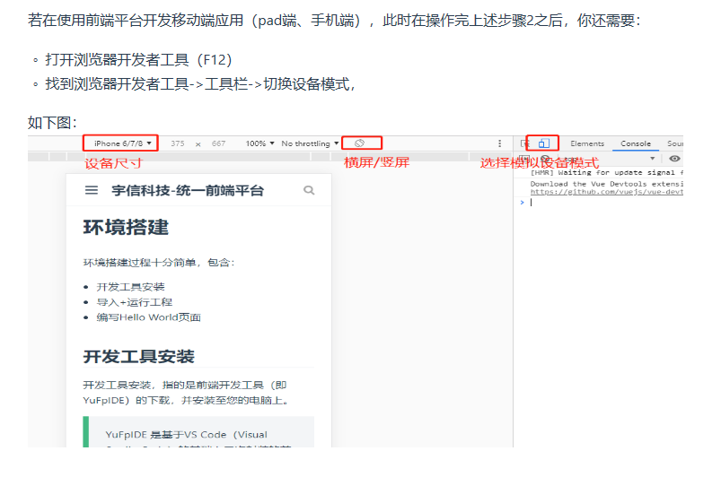
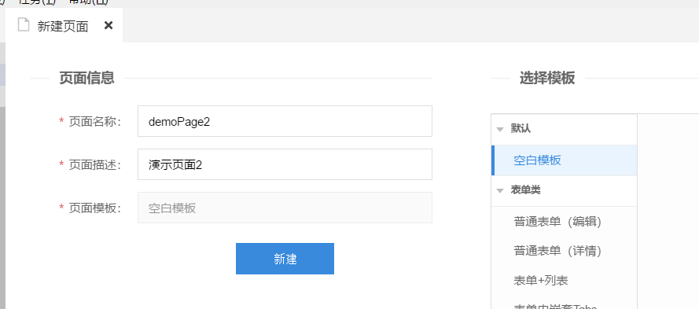
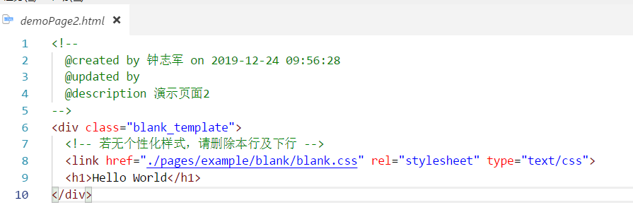

# 环境搭建

## 1. YuFpIDE下载

http://192.168.251.163:9527/yudp/#!yufpIde   (?下载不了?)

## 2. 运行工程

打开 yufp-web 项目

1. 配置[全局参数](http://192.168.251.163:9527/xy-guide/api/core-api.html#全局配置)
	开发阶段，请在`config.js`将全局配置参数`debugModel`，`mockModel`都配置为`true`。
	
2. 运行（预览）工程
    右键Index.html 预览即可或直接点击YuFpIDE右下角工具栏区域“预览”按钮   
    
3. 浏览器访问工程

    

## 3. HelloWorld

### 3.1 PC端HelloWorld

新建PC工程，然后在 pages/example  下面新建文件夹 demo，并右键修改备注为 演示 。在demo文件夹里面 新建空白页面:

​	删除 `class="blank_template"`  和 blank.clss 那一行。 

左侧选择文件，右键预览即可看到页面效果。

### 3.2 手机/Ipad端HelloWord

新建手机端项目，然后在 pages/example  下面新建文件夹 demo，并右键修改备注为 演示 。在demo文件夹里面 新建空白页面，修改html文件，将 yu-content标签内文字替换改变即可，预览的时候要按F12打开控制台，并切换视图到移动设备。