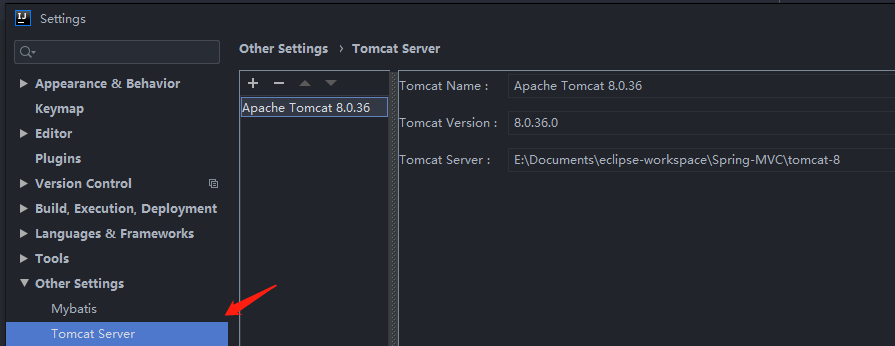
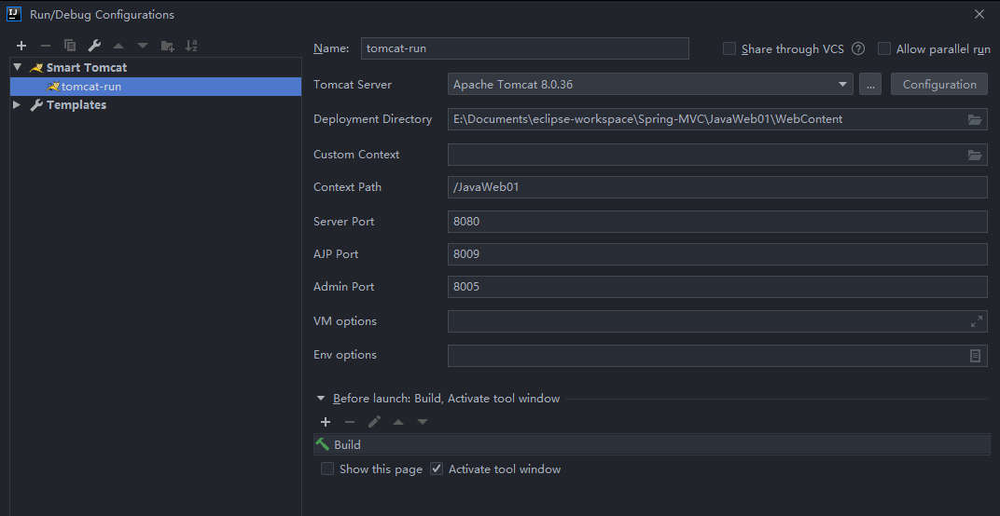

# Idea 新建JavaWeb项目

##  新建项目
 1. 新建一个Java项目 JavaWeb01 

2. 新建 目录 WebContent

3. 在WebContent 里面新建WEB-INF目录

4. 在WEB-INF里面新建目录lib

5. 将jsp-api.jar 和servlet-api.jar复制进来(找不到合适的版本的话，可以去tomcat的lib目录下面复制),将lib目录 add as library 

6. 在WEB-INF里面增加web,xml

    ```xml
    <?xml version="1.0" encoding="UTF-8"?>
    <web-app xmlns:xsi="http://www.w3.org/2001/XMLSchema-instance" xmlns="http://java.sun.com/xml/ns/javaee" xsi:schemaLocation="http://java.sun.com/xml/ns/javaee http://java.sun.com/xml/ns/javaee/web-app_3_0.xsd" id="WebApp_ID" version="3.0">
    	<display-name>JavaWeb01 </display-name>
    	<welcome-file-list>
    		<welcome-file>index.html</welcome-file>
    	</welcome-file-list>
    </web-app>
    ```

    7. 在WebContent下面增加index.html文件

        ```html
        <html>
            <head>Welcome</head>
            <body>
                <h2>Hello World</h2>
            </body>
        </html>
        ```

## 启动项目

1. 安装tomcat插件 Smart tomcat

2. 配置tomcat

    

3. 添加启动项

    

4. 运行项目，访问测试页面

     http://localhost:8080/JavaWeb01

