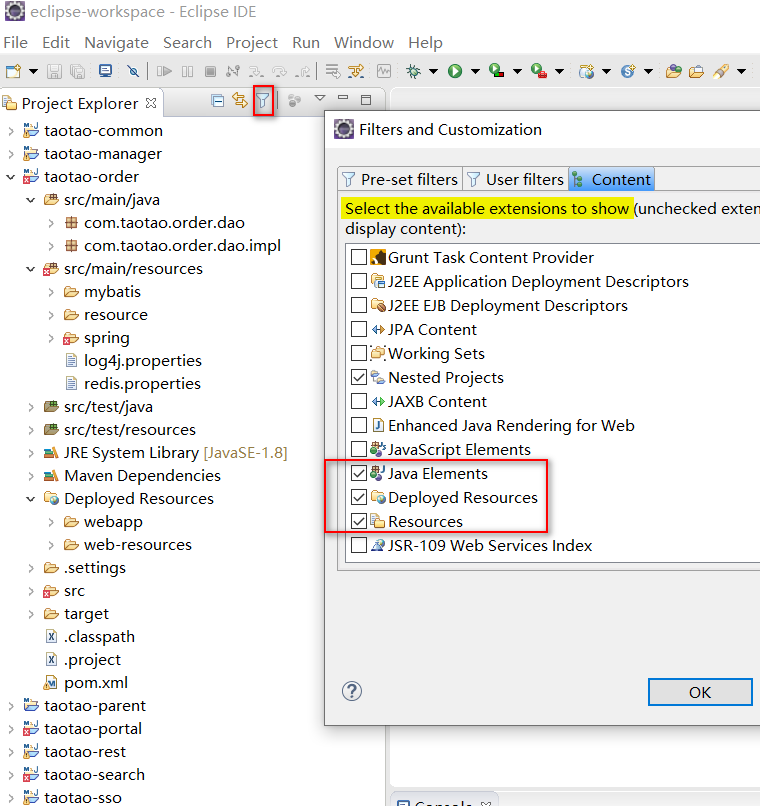
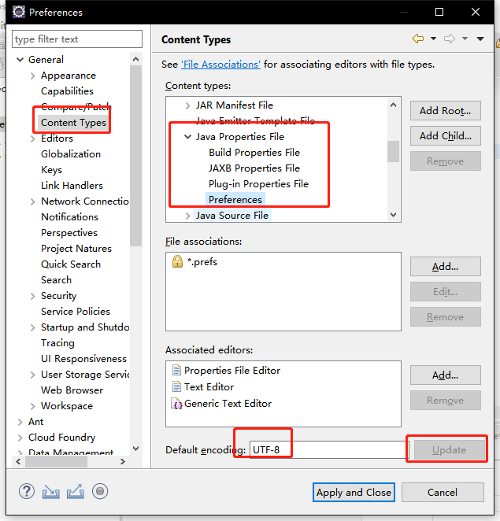
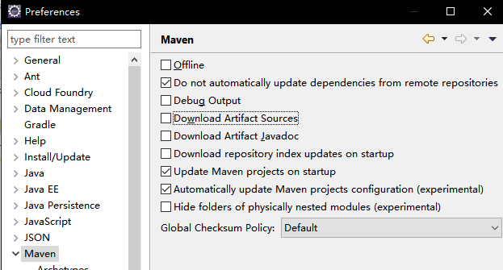

# eclipse

安装目录: c:\soft

## 1. 刚安装好的优化

### 1.1eclipse.ini  中 增大Xms和Xmx

### 1.2 Preferences 中 Validation 设置 Suspend all validators

### 1.3 修改console控制台输出最大行数（默认80000）

 **Windows->Preferences->Run/Debug->Console --> Limit console output** 

设置为  580000 

### 1.4 设置自动保存代码

Preferences-->General-->Editors-->Autosave  

​	设成 3

### 1.5 设置使用spaces 代替 tabs

Preferences-->General-->Editors-->  Text Editors --> Insert spaces for tabs

### 1.6  保存文件时自动格式化代码,优化import，自动加上 没加的  @Override 注解

 **windows-->Preferences-->Java --> Editor-->Save Actions** 

设置 Format edited lines , Organize imports ,  Additional actions

### 1.7 格式化HTML 代码排版问题

 1、打开**Windows-->preference-->Web** 
2、展开，选择**HTML Files -->Editor** 
3、右侧的**line width**适当的修改，比如200；然后将**Inline Elements**内的标签全部删除。点击ok完成 

### 1.8 调整列宽

Xml -->XML Files --> Editor  

Line width 设置为 400

Java  -->Code Style  --> Formatter   new 一个 Formatter

  Line Wrapping  --> Maximum line width 设置为 400 

Comments -->  Maximun width for comments 设置为 400

### 1.9 调整代码提示功能

原来的代码提示是 `.`  触发，现在调整为所有的字母和 `.` 都触发

Java -- > Editor --> Content Assist  --> Auto activation triggers  for Java : 

 `ABCDEFGHIJKLMNOPQRSTUVWXYZabcdefghijklmnopqrstuvwxyz.` 

### 1.10 设置 字体

General --> Apperance --> Colors and font  -->Basice --> 

text font 设置为  Courier New  常规 12

###  1.11 更改主题

 general --> Apperance -- >   Light [Mac OS ]  不懂..

### 1.12 关闭自动更新

install/update  --> automatic Updates  

### 1.13 调整左侧Project Explorer树显示的内容分类

(都没找到这个配置)  

### 1.14 设置默认编码 utf 8

General --> workspace --> Text file encoding 

### 1.15 Jsp 编码调整为 utf8

Web --> Jsp files 

### 1.16 修改properties 文件为 utf8

### 1.17 配置maven

