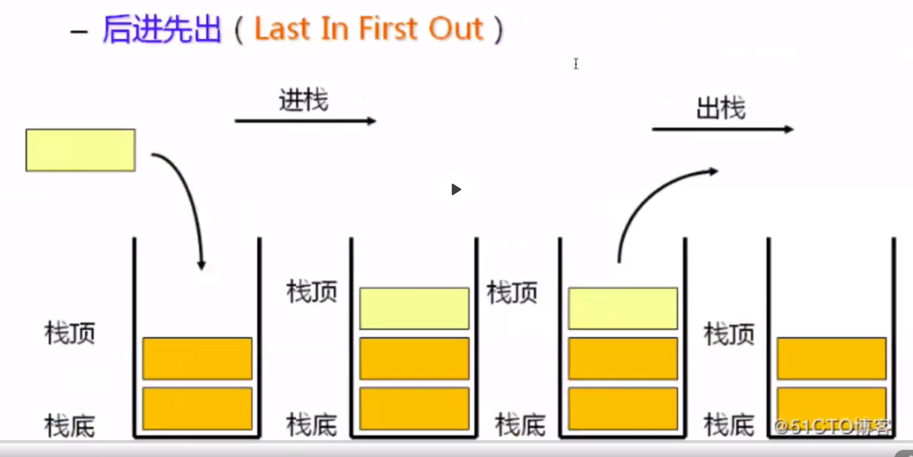

# 数据结构

[toc]

# 1. 栈

栈的特点是 后进先出 




## 1.2 栈的主要方法

-   入栈 : void push(T t);
-   出栈 :  T  pop();
-   返回栈顶元素  :  T   top();
-   返回栈 元素个数  :  int size();
-   返回栈 是否为空:  boolean  isEmpty();
-   清空栈:  void clear();


## 1.3 栈的简单实现

```java
package com.company;

import java.util.ArrayList;
import java.util.List;

/**
 * 栈的简单实现
 * 只包含一些主要的方法的简单实现
 */
public class Stack<T> {
    private int capacity;
    //保存数据
    List<T> list = null;
    public Stack(int capacity){
        if (capacity<1){
            throw  new IllegalArgumentException("栈的大小不能小于1");
        }
        this.capacity=capacity;
        list=new ArrayList<>(capacity);
    }

    /**
     * 入栈： 添加一个元素到栈顶
     */
    public boolean push(T obj){
        if(capacity<=list.size()){
            return false;
        }
        return list.add(obj);
    }

    /**
     * 出栈： 弹出并返回栈顶元素
     */
    public T pop(){
        if (isEmpty()){
            return null;
        }
       return list.remove(list.size()-1);
    }

    /**
     * 返回栈顶元素
     */
    public T top(){
        if (isEmpty()){
            return null;
        }
        return list.get(list.size()-1);
    }

    /**
     * 返回栈当前元素个数
     */
    public int size(){
        return list.size();
    }
    /**
     * 返回 当前栈是否为空
     */
    public boolean isEmpty(){
        return  list.size()==0;
    }
    /**
     * 清空栈
     */
    public void clear(){
        list.clear();
    }
}
```

## 1.4 栈的运用

### 1.4.1  括号匹配问题

有时候需要检测括号是否正确匹配，可以使用栈 来实现。

当匹配到左括号 `(`  时，入栈，当匹配到右括号  `)`  时，出栈。 字符串匹配完成的时候，如果栈为空，即可证明括号匹配正确。

如果使用 一个计数器，(  +1 ,  ) -1 的话，会出现下列情况也返回正确:`)))(((`

```java
public boolean bracketMatching(String s) {
    Stack<Character> stack = new Stack<>(s.length() / 2 + 1);
    char ch;
    boolean result = true;
    for (int i = 0; i < s.length(); i++) {
        ch = s.charAt(i);
        if (ch == '(') {
            result = stack.push(ch);
            if (!result) {
                return false;
            }
        } else if (ch == ')') {
            ch=stack.pop();
            if (ch!='('){
                return false;
            }
        }
    }
    if (!stack.isEmpty()){
        result=false;
    }
    return result;
}
```

### 1.4.2 撤销、前进功能

使用一个栈来保存撤销的内容，一个栈来保存前进的功能

```java
package com.company;

import java.time.LocalDateTime;
import java.time.format.DateTimeFormatter;

/**
 * 简单编辑器
 */
public class SimpleEditor {
    //保存字符串
    private StringBuilder content = new StringBuilder();

    //后退栈
    private Stack<String> backStack=new Stack<>(128);
    //前进栈
    private Stack<String> headStack=new Stack<>(128);

    public void display() {
        LocalDateTime now = LocalDateTime.now();
        String date=now.format(DateTimeFormatter.ofPattern("yyyy-MM-dd hh:mm:ss"));
        System.out.println("================================================================================================= "+date);
        System.out.println(content.toString());
        System.out.println("================================================================================================= "+date);
    }

    //后退
    public void back() {
        if (backStack.isEmpty()){
            System.out.println("后退无效");
        }else {
            String s = backStack.pop();
            headStack.push(content.toString());
            content=new StringBuilder(s);
        }
    }

    //前进
    public void head() {
        if (headStack.isEmpty()){
            System.out.println("前进无效");
        }else {
            String s = headStack.pop();
            backStack.push(content.toString());
            content=new StringBuilder(s);
        }
    }
    //写入
    public void write(String s){
        backStack.push(content.toString());
        content.append(s);
        headStack.push(content.toString());
    }
}
```

```java
@Test
public void SimpleEditorTest(){
    SimpleEditor simpleEditor = new SimpleEditor();
    simpleEditor.write("123456789");
    simpleEditor.display();

    simpleEditor.back();
    simpleEditor.display();

    simpleEditor.head();
    simpleEditor.display();
}
```

### 1.4.3 逆波兰表达式

逆波兰表达式，也叫后缀表达式，将复杂表达式转换为可以依靠简单的操作得到结果的表达式，例如:

(a+b)*(c+d) ==>  ab+cd+ \*

.. 实在看着头痛。略过了。


中缀表达式:   1+2   、 1+2+3 ..

后缀表达式:   1 2 + 、 1 2 3 + +   

计算机计算中缀表达式的时候需要先转换成后缀表达式。

后缀表达式计算过程:  

[4,13,5,/,+] 等价于 (4+(13/5))=6

从左到右，遇到第一个非数字时，  / , 取 前两个数字, 13、5  然后做除法运算 13/5=2 ，然后得到  [4 ,2 ,+], 再从左到右，遇到 + 时， 取 前两个数字 4、2 做+ 运算 得到 6 。

```java
/**
     * 后缀表达式
     */
public int postfixExpression(String...arr){
    List<String> priority= Arrays.asList("*","/","-","+");
    if (arr.length<3){
        throw  new IllegalArgumentException("后缀表达式的数组长度不能小于3");
    }
    int num1;
    int num2;
    String s;
    Stack<Integer> stack=new Stack<>();
    for (int i=0;i<arr.length;i++){
        s=arr[i];
        if (priority.indexOf(s)!=-1){
            num1=stack.pop();
            num2=stack.pop();
            stack.push(calculation(num2,num1,s));
        }else{
            stack.push(Integer.parseInt(s));
        }
    }
    return stack.pop();
}

public int calculation(int num1, int num2, String operator) {
    switch (operator) {
        case "+": {
            return num1 + num2;
        }
        case "-": {
            return num1 - num2;
        }
        case "*": {
            return num1 * num2;
        }
        case "/": {
            return num1 / num2;
        }
        default: {
            throw new IllegalArgumentException();
        }
    }

}
```

```java
@Test
public void  testPostfixExpression(){
    String[] arr = {
        "4","13","5","/","+"
    };
    System.out.println(postfixExpression(arr));
}
```

### 1.4.4  栈的min方法

实现一个带min 方法的栈，返回栈里面最小的元素，且时间复杂度为 O(1)

这里使用一个栈保存最小值，如果使用一个变量的话，无法保存历史，如果栈的当前数据为 [3,4,5,2]  当前最小为 2 ， pop 之后，就没法知道下一个最小值的了(正确的应该是3才对)。

```java
package com.company;

/**
 * 带 min 方法的 stack
 */
public class MinStack<T extends Comparable<T>> extends Stack<T> {
    private Stack<T> minStack;

    public MinStack(int capacity) {
        super(capacity);
        minStack = new Stack<>();
    }

    public MinStack() {
        super();
        minStack = new Stack<>();
    }

    @Override
    public boolean push(T obj) {
        boolean res = super.push(obj);
        if (res) {
            if (minStack.isEmpty()){
                minStack.push(obj);
            }else {
                T top = minStack.top();
                if (obj.compareTo(top)<=0){
                    minStack.push(obj);
                }
            }
        }
        return res;
    }

    @Override
    public T pop() {
        T res = super.pop();
        if (minStack.top().compareTo(res)==0){
            minStack.pop();
        }
        return res;
    }

    public T min() {
        return minStack.top();
    }
}
```

```java

@Test
public void testMinStack(){
    MinStack<Integer> minStack=new MinStack<>();
    minStack.push(5);
    minStack.push(3);
    minStack.push(2);
    minStack.push(4);
    System.out.println(minStack);
    System.out.println(minStack.min());
    minStack.pop();
    System.out.println(minStack);
    System.out.println(minStack.min());
    minStack.pop();
    System.out.println(minStack);
    System.out.println(minStack.min());
    minStack.pop();
    System.out.println(minStack);
    System.out.println(minStack.min());
}
```

### 1.4.5 中缀表达式转后缀表达式


